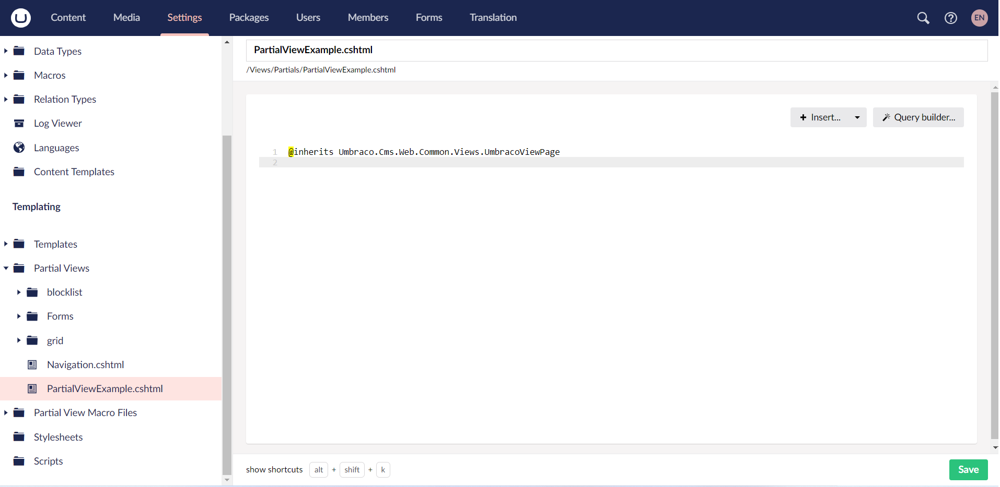
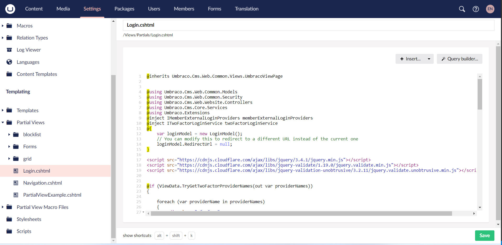
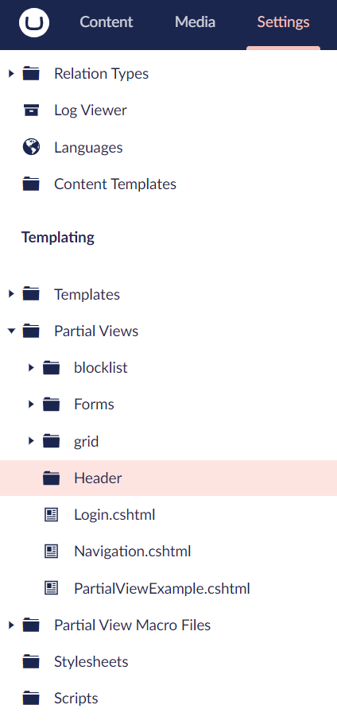

# Partial Views

A Partial View (`.cshtml` file) is a regular view that can be used multiple times throughout your site. A Partial View is used to break up large markup files into smaller components such as header, footer, navigation menu, etc. It helps to reduce the duplication of code. A partial view renders a view within the parent view.

## Partial Views in the Backoffice

You can create and edit partial views in the **Partial Views** folder from the **Settings** section of the Backoffice.


In the **Create** menu, there are three options available:

* New empty partial view
* New partial view from snippet
* Folder (for keeping the partial views organized)

## Creating a Partial View

To create a partial view, go to the **Settings** section in the Umbraco backoffice and right-click the **Partial Views** folder. Choose **Create**. Select **New empty partial view** and enter a partial view name and click the **Save** button. You will now see the partial view markup in the backoffice editor.



By default, the partial view is saved in the `Views/Partials` folder in the solution.

## Creating a Partial View from Snippet

To create a partial view from the snippet, go to the **Settings** section in the Umbraco backoffice and right-click the **Partial Views** folder. Choose **Create**. Select **New empty partial view from snippet**. Select the snippet you want to create a partial view for and enter a partial view name. The code snippet you selected is displayed in the backoffice editor. Click the **Save** button.



By default, the partial view is saved in the `Views/Partials` folder in the solution. Umbraco provides the following partial view snippets:

* Empty - Creates an empty partial view file.
* Breadcrumb - Creates a breadcrumb of parents using the `Ancestors()` method to generate links in an unordered HTML list. It displays the name of the current page without a link.
* Edit Profile - Creates a Member profile model that can be edited.
* List Ancestors From Current Page -  Displays a list of links to the parents of the current page using the `Ancestors()` method to generate links in an unordered HTML list. It displays the name of the current page without a link.
* List Child Pages From Current Page - Displays a list of links to the children of the current page using the `Children()` method to generate links in an unordered HTML list.
* List Child Pages Ordered By Date -  Displays a list of links to the children of the current page using the `Children()` method to generate links in an unordered HTML list. The pages are sorted by the creation date in a descending order using the `OrderByDescending()` method.
* List Child Pages Ordered By Name - Displays a list of links to the children of the current page using the `Children()` method to generate links in an unordered HTML list. The pages are sorted by the page name using the `OrderBy()` method.
* List Child Pages With DocType - Displays only the children of a certain Document Type.
* List Descendants From Current Page - Displays a list of links for every page below the current page in an unordered HTML list.
* Login - Displays a login form.
* Login Status - Displays the user name if the user is logged in.
* Multinode Tree-picker - Lists the items from a Multinode tree picker using the picker's default settings.
* Navigation - Displays a list of links of the pages under the top-most page in the Content tree. It also highlights the currently active page/section in the navigation menu.
* Register Member - Displays a Member registration form. It will only display the properties marked as **Member can edit** on the **Info** tab of the Member Type.
* Site Map - Displays a list of links of all the visible pages of the site using the `Traverse()` method to select and display the markup and links as nested unordered HTML lists.

## Creating a Folder

To create a folder, go to the **Settings** section in the Umbraco backoffice and right-click the **Partial Views** folder. Choose **Create**. Select **Folder**. Enter a folder name and click the **Create** button.



## Rendering a Partial View

To render the created partial view into any template, use any of these helper methods: `@Html.PartialAsync`, `@Html.Partial()`, or `@Html.RenderPartial()`

```csharp
@using Umbraco.Cms.Web.Common.PublishedModels;
@inherits Umbraco.Cms.Web.Common.Views.UmbracoViewPage<ContentModels.HomePage>
@using ContentModels = Umbraco.Cms.Web.Common.PublishedModels;
@{
	Layout = null;
}

@await Html.PartialAsync("Login")

@Html.Partial("Login")

@{
 Html.RenderPartial("Login");   
}
```

### Related Articles

* [Using MVC Partial Views in Umbraco](../../reference/templating/mvc/partial-views.md)

### Video Materials


Getting started with Umbraco: Partial Views

