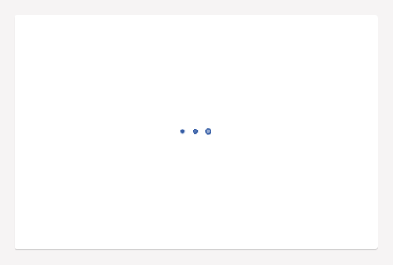

# umbLoadIndicator

Many web sites and web applications use a form of load indicator to indicate a busy state to the user. Throughout the backoffice, Umbraco uses three animated circles as a load indicator - eg. as shown below:



Umbraco internally does this via the `<umb-load-indicator />` directive, which you can also use in your own views for the backoffice.

- [`<umbLoadIndicator />` in the **API documentation**](https://apidocs.umbraco.com/v9/ui/#/api/umbraco.directives.directive:umbLoadIndicator)
- [`<umbLoadIndicator />` source code on **GitHub**](https://github.com/umbraco/Umbraco-CMS/blob/v8/contrib/src/Umbraco.Web.UI.Client/src/common/directives/components/umbloadindicator.directive.js)

The directive doesn't have any parameters on it's own, but since you most likely only wish to show the load indicator during certain states of your code, you can control this  either through `ng-if` or `ng-show`.

For instance if your controller sets the `loading` variable to `true` during busy states:

```html
<umb-load-indicator ng-if="vm.loading"></umb-load-indicator>
````

The directive uses CSS and absolute position to center it self in. For instance, if you're also using the `<umb-box-content />` directive, you can set it's position to `relative`:

```html
<umb-box>
    <umb-box-content style="height: 250px; position: relative;">
        <umb-load-indicator />
    </umb-box-content>
</umb-box>
```

As seen on the animation in the beginning of this page, the load indicator is centered in the white box.
