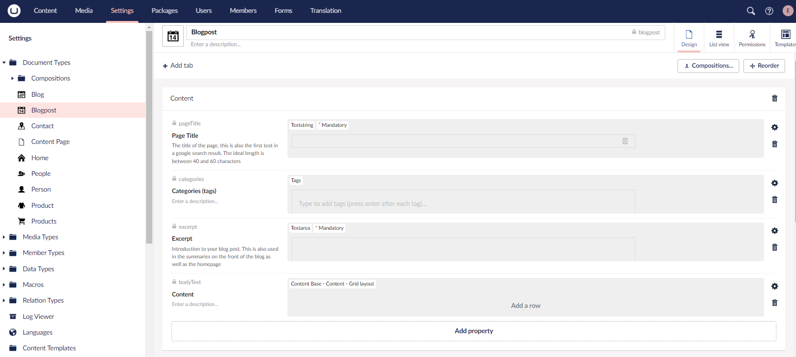
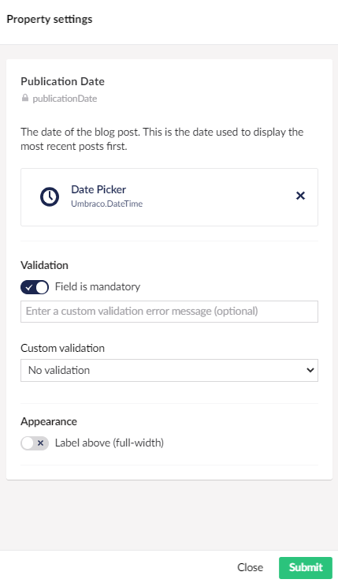

# Add a Blog Post Publication Date

In this lesson, you will learn how to add a new date property to blog posts.

## Outcome

Content editors can specify the publication date for a blog post. Blog posts are displayed with the most recent publication date appearing first.

## Takeaway

Learn how to:

* Add a new property to a Document Type
* Edit a Template to display the new property
* Sort a list of items by a new property

## Steps - Part One

1. In the **Settings** section, expand **Document Types**.
2. Click on *Blogpost*. This is the Document Type that defines the fields for this type of page.

    

3. The Document Type contains 2 groups: *Content* and *Navigation & SEO*.
    * At the bottom of the *Content* group select **Add property**.
    * This opens the **Property Editor** dialog window.

4. Give the property a name: *Publication Date*.
5. Give the property a description: *The date of the blog post. This is the date used to display the most recent posts first.*.

    * Always try to add a meaningful description to help your editors.

6. Select **Add editor** to specify what type of data is being stored.
    * We need a standard date, so click on the **Date Picker** icon.

7. In the validation section, enable the field to make it mandatory.
8. Submit to close the dialog and save the property.

    

9. Select the **Reorder** option near the top-right of the window, then drag the new property to be after *Page Title*.
    * A logical order to your properties will make things easier for your editors.
10. Click **I am done reordering** near the top-right of the window and select **Save** the Document Type - a confirmation message should appear confirming that the Document Type was saved.
