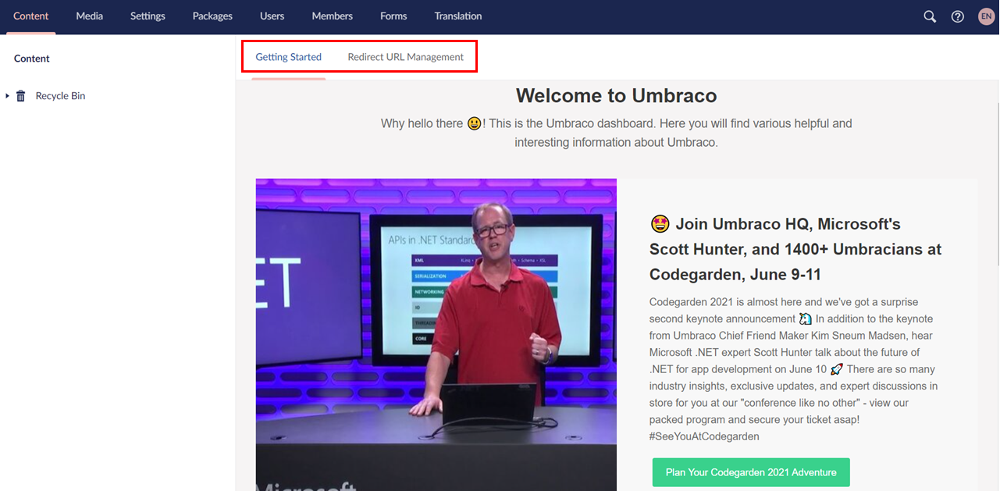

# Umbraco Interface

## Initial View

After logging in to an Umbraco project you will be presented with a dashboard containing a wide array of buttons and features. Let's quickly go through what each feature does.

### The Dashboard

By default, there are two dashboards available:

1. The **Getting Started** dashboard provides helpful information about Umbraco.
2. The **Redirect URL Management** dashboard displays the original and redirected links of the published pages which are moved to a new location in your project.

### Search, Help, and Profile Settings

1. The **Search** bar allows you to search for the content in your entire project.
2. The **Help** icon provides different Help options such as Tours, Umbraco Learning Base YouTube videos, Umbraco Documentation, and your System Information.
3. The **profile** icon allows you to edit your profile, change the password, and Logout from the application.

### The Sections Menu

The following sections are available in the backoffice:

* **Content** - allows to manage your content.
* **Media** - allows to manage images and other media files.
* **Settings** - allows to handle your meta data such as document types.
* **Packages** - allows to manage and install packages.
* **Users** - allows to manage the users on the project. To learn more about users, see the [Users](../../../fundamentals/data/users.md) article.
* **Members** - allows to handle the members of the project. If you want to learn more about Members, see the [Members](../../../fundamentals/data/members.md) article.
* **Forms** - allows to create and manage your forms.
* **Translation** - allows to manage dictionary items.

The menu list will differ depending on your permissions for the project. For example: if you are an editor, then you will only have access to **Content**, **Media** and **Forms** as per default settings.

### The Section tree

The section tree is different depending on the section you are in. The section provides an overview of the nodes contained in the tree.

In this example, you are looking at the content section.

<figure><figcaption></figcaption></figure>

The **Content** tab allows you to create content nodes and manage your content tree. When you hover over the sections, it is highlighted with a darker color indicating that you are hovering over it. A button with three dots will show up, left-click or right-click to view additional options.

The **Recycle Bin** contains the deleted content and is available only in the **Content** and the **Media** section.
