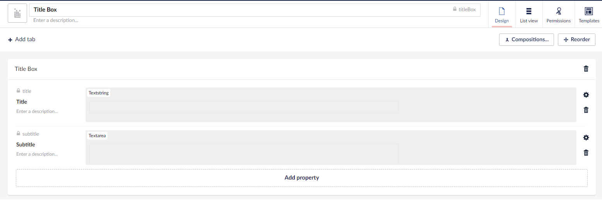
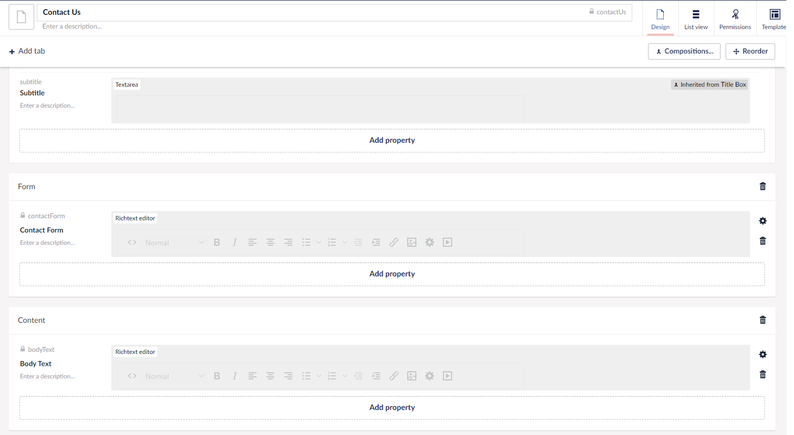
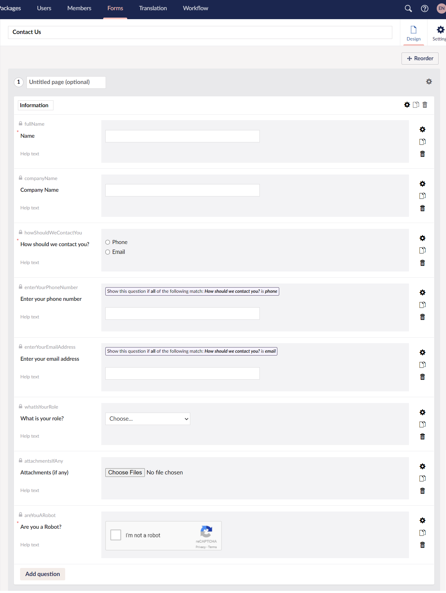

# Creating a Contact Form

In this tutorial, we'll look at creating a Contact Form using Umbraco Forms. It will take you through the process of creating a Contact Form and cover all the different components involved in building the form.

You can use a Contact Form on your website to allow a visitors to send you a message. Having a Contact Form on your website allows you to keep track of potential customer queries and possibly generate leads via email communication.

## Video Tutorial


Creating a Contact Us Form using Umbraco Forms


## Step 1: Configure the Document Types

The first step in this tutorial is to configure the Document Types that will be used to show the Contact Form on your website.

### Creating a Composition

We'll start off by creating a Composition. A Composition is a stand-alone Document Type, that you can reuse on other Document Types. By creating a Composition, we are not duplicating the same properties on multiple Document Types. This is helpful when we want to use the same set of properties on multiple Document Types.

To create a Composition, follow these steps:

1. Go to **Settings** in the Umbraco Backoffice.
2. Expand the **Document Types** folder in the **Settings** tree.
3. Select **...** next to the **Compositions** folder.
4. Click **Composition**.  

5. Enter a **Name** for the **Composition**- let's call it _Title Box_.
6. Add the following fields with the respective specifications:

| Group     | Field Name | Alias    | Data Type  |
|-----------|------------|----------|------------|
| Title Box | Title      | title    | Textstring |
| Title Box | Subtitle   | subtitle | Textarea   |

7. **Save** Composition.

### Creating a Contact Us Document Type with Template

Next, we will create a Document type with template. A Document Type contains different properties for holding different types of content. The Document Type we create here will be the one used for creating the content page that will hold our Contact Form.

To create a **Contact Us** Document Type, follow these steps:

1. Go to **Settings** in the Umbraco Backoffice.
2. Select **...** next to the **Document Types** folder.
3. Select **Document Type with Template**.  
4. Enter a **Name** for the **Document Type**- let's call it _Contact Us_.
5. Select **Compositions** in the top-right corner.
6. Make sure the **Title Box** Composition is checked.
7. **Submit** the change.
8. Add the following fields with the respective specifications:

| Group   | Field Name   | Alias       | Data Type       |
|---------|--------------|-------------|-----------------|
| Form    | Contact Form | contactForm | Richtext Editor |
| Content | Body Text    | bodyText    | Richtext Editor |

9. **Save** the Document Type.

### Updating the Document Type Permission

In the following we will update the Document Type permissions to specifically add child nodes under the root content node.

To update the **Contact Us** Document Type permissions, follow these steps:

1. Navigate to the Document Type used for the root content node on your website, in this case **Home Page**.
2. Go to the **Permissions** tab.
3. Select **Add child** in the **Allowed child node types** section.
4. Select the **Contact Us** page.

5. **Submit** the changes.
6. **Save** the Document Type.

## Step 2: Prepare the Content Node

This step takes you through creating the content node for your Contact Form. The content node uses the Document Type and Template to serve up an HTML page to web visitors.

To add the content node, follow these steps:

1. Go to **Content** in the Umbraco Backoffice.
2. Select **...** next to the **Home Page**.
3. Create a **Contact Us** page.
4. Enter the name for the content node. let's call it _Contact Us_.
5. Enter a **Title**, **Subtitle**, and **Body Text** value. These can always be updated at a later point.

6. **Save** or **Save and Publish** the content node.

## Step 3: Creating the Contact Form

In this step, we will create the Contact Form using Umbraco Forms.

To create a form, follow these steps:

1. Navigate to the **Forms** section in the Umbraco Backoffice.
2. Click **...** next to the Forms folder.
3. Choose the **Empty Form** option.
4. Enter a **Name** for the Form- let's call it _Contact Us_.
5. _[Optional]_ Enter a **Group Name** for the Data Consent query - let's call it _Data Consent_.
6. **Add new group** - let's call it _Information_.
7. Select **Add Question** to add a new field.
8. Enter the following details:

| Field Name         | Value                |
| ------------------ | -------------------- |
| Enter question     | **Name**                 |
| Alias              | fullName             |
| Choose answer type | Short answer         |
| Field Type         | text                 |
| Mandatory          | Yes                  |

9. **Submit** the changes.
10. Repeat **steps 7-9** to add the following fields:

| Field Name         | Value                |
| ------------------ | -------------------- |
| Enter question     | **Company Name**         |
| Choose answer type | Short answer         |

| Field Name         | Value                      |
|--------------------|----------------------------|
| Enter question     | **How should we contact you?** |
| Choose answer type | Single choice              |
| Prevalues Items    | phone, email               |
| Mandatory          | Yes                        |

| Field Name         | Value                      |
|--------------------|----------------------------|
| Enter question     | **Enter your phone number**    |
| Choose answer type | Short answer               |
| Field Type         | tel                        |
| Validation         | Validate as a number       |

11. Select **Enable Conditions** on the _Enter your phone number_ field.
12. Click **Add Condition**.
13. Select **How should we contact you? from the dropwdown**.
14. Enter **phone** in the value field.
15. **Submit** the changes.
16. Repeat **steps 7-9** to add the following field:

| Field Name         | Value                        |
|--------------------|------------------------------|
| Enter question     | **Enter your email address**     |
| Choose answer type | Short answer                 |
| Field Type         | email                        |
| Validation         | Validate as an email address |

17. Select **Enable Conditions** on the _Enter your email address_ field.
18. Click **Add Condition**.
19. Select **How should we contact you? from the dropwdown**.
20. Enter **email** in the value field.
21. **Submit** the changes.
22. Repeat **steps 7-9** to add the following field:

| Field Name         | Value                                                    |
|--------------------|----------------------------------------------------------|
| Enter question     | **What is your role?**                                       |
| Choose answer type | Dropdown                                                 |
| Prevalues Items    | manager, developer, tester, writer, marketing specialist |

| Field Name                     | Value                    |
|--------------------------------|--------------------------|
| Enter question                 | **Attachments (if any)**     |
| Choose answer type             | File upload              |
| Predefined allowed file types  | pdf, png, jpg, gif, txt  |

| Field Name         | Value               |
|--------------------|---------------------|
| Enter question     | **Are you a Robot?**    |
| Choose answer type | reCAPTCHAv2         |
| Theme              | light               |
| Size               | normal              |
| Mandatory          | Yes                 |

23. Select the **Reorder** option.
24. Drag the **Data consent** group below the **Information** group.
25. Click **I am done reordering**.
26. **Save** the form.

### Configuring the Form Workflow

Workflows is how you determine what you happen after your form is submitted. It could be actions like sending an email or displaying a "Thank You" message.

To configure the Form workflow, follow these steps:

1. Select the **Submit message/ Go to page** options in the bottom of the Forms editor.
2. Enter a customised message in the **Message on Submit** field.
3. **Submit** the change.
4. Click on **Send template email to xxx@xx.dk**.
5. Select **Example-Template.cshtml** in the **Email template** field.
6. Enable **Attachments**.
7. Enter an email address in the **Sender Email** field.
8. **Submit** the changes.
9. **Save** the form.

### Configuring the Form Settings

In this step, you will find the information about accessing the Forms Settings and the validations available to customise your form.

To configure the form settings, follow these steps:

1. Navigate to the **Settings** tab in the Forms editor.
2. Scroll to find the **Validation** section.
3. Ensure that the **Mark Mandatory fields** option is checked under **Mark fields**.
4. **Save** the changes.


There are multiple settings that be configured. These are all optional in relation to this tutorial.


## Step 4: Adding the Contact Form to the Content Node

Now that you have created your Contact Form, you can add it in the Contact Us Content Node using the Rich Text Editor. We will use the **Insert Form** macro to insert a form.

To add the Contact Form to the Content Node, follow these steps:

1. Navigate to the **Content** section in the Umbraco Backoffice.
2. Open the **Contact Us** Page.
3. Select **Insert macro** in the **Contact Form** field.
4. Select the **Insert Form with Theme** option.
5. Select **Add** in the **Choose a form** field.
6. Choose the **Contact Us** Form.
7. Select **Add** in the **Theme** field.
8. Choose the **default** theme.

9. **Submit** the changes.
10. **Save** or **Save and Publish** the content node.

## Step 5: Additional configuration

In the next couple of steps, we will add some additional configuration required in order for our form to work properly.

### Configuring the reCAPTCHA value

When you inserted the form in the previous step, you will notice an error message in the reCAPTCHA field. You need to update the configuration to include a value in the `appsettings.json` file.

To configure the reCAPTCHA value, see the [reCAPTCHA configuration](../../developer/configuration/README.md#recaptcha-v2-field-type-configuration) article.

### Configuring Simple Mail Transfer Protocol (SMTP)

By adding the SMTP settings in the `appsettings.json` file, you can send out emails from your Umbraco installation. It is required in order for your form to be able to send emails on submission.

To configure the SMTP settings, see the [Global Settings](https://docs.umbraco.com/umbraco-cms/reference/configuration/globalsettings#smtp-settings) article.

## Step 6: Rendering the Contact Form

In this step, we will render the values of the Contact Us Document Type in the template.

To render the Contact Form, follow these steps:

1. Navigate to the **Settings** section in the Umbraco Backoffice.
2. Open the **Contact Us** template in the **Templates** folder.
3. Choose the **Insert** option and select **Value**.
4. Select **contactForm** from the **Choose field** dropdown.
5. **Submit** the changes.
6. Follow **steps 3-5** to insert the **bodyText** value.
7. **Submit** the changes.
8. **Save** the template.

## The final result

Finally, it is time to view the Contact Form on the frontend.

To view the Contact Form on the Frontend, follow these steps:

1. Navigate to the **Content** section in the Umbraco Backoffice.
2. Open the **Contact Us** Page.
3. Ensure that the page is published.
4. Go to the **Info** tab.
5. Click on the Published link in the **Links** section.

You now have a full-fledged Contact Form ready to be used on your website.
