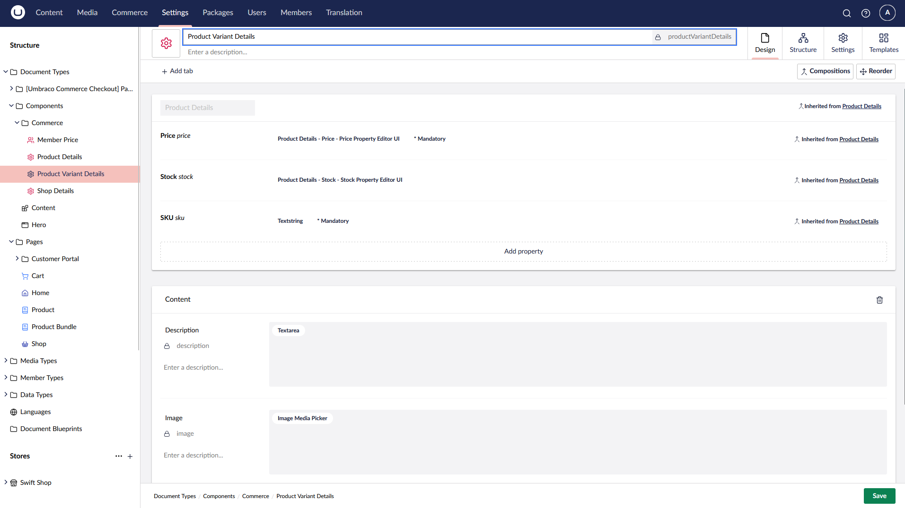

# Product Bundles

When you need to create a product with multiple sub-products, you can use the
bundling concept to create a final order line as a composite order line of the
selected primary product and its sub-product options.

The following use case is not mandatory when working with bundles, as any product can be a bundled one.

## Backoffice Configuration

For our bundle content structure, we will use a standard product page with a
structure that allows as child nodes a product variant type.



The bundle content tree will contain a bundle page with variant elements as children.


## Product Bundle Page

Our base product page will display the details of the product with a list of variants that can be used as addons.


````csharp
<div class="container">
    @using (Html.BeginUmbracoForm("AddToCart", "Cart", FormMethod.Post, new { @name = "addToCartForm" }))
    {
        <div class="row justify-content-center">
            <!-- Start Column 1 -->
            <div class="col-md-12 col-lg-3 mb-5 mb-lg-0">
                <h2 class="mb-4 section-title">@Model.Headline</h2>
                <p class="mb-4">@Model.Description</p>

                <ul class="list-group list-group-flush">
                    @foreach (var item in Model.Children<ProductVariantDetails>())
                    {
                        <li class="list-group-item">
                            <input id="chk_@item.Id" class="form-check-input me-1 align-middle" type="checkbox"
                                value="@item.GetProductReference()" name="bundleOptionReferences[]" />
                            <a href="javascript:void(0)" style="text-decoration: none;">
                                
                                <label for="chk_@item.Id">@item.Name</label>
                                <strong>+ @(await item.GetFormattedPriceAsync())</strong>
                            </a>
                        </li>
                    }
                </ul>
            </div>
            <!-- End Column 1 -->
            <!-- Start Column 2 -->
            <div class="col-12 col-md-4 col-lg-3 mb-5 mb-md-0">

                @Html.Hidden("bundleProductReference", Model.GetProductReference())
                @Html.Hidden("quantity", 1)

                <a class="product-item" onclick="document.forms['addToCartForm'].submit()">
                    
                    <h3 class="product-title">@Model.Title</h3>
                    <strong class="product-price">Base Price: @(await Model.GetFormattedPriceAsync())</strong>

                    <span class="icon-cross">
                        
                    </span>
                </a>
            </div>
            <!-- End Column 2 -->
        </div>
    }
</div>
````

## Add to Cart Functionality

Finally, in our add to cart functionality, based on the product reference (bundle or not), we will add the base product to cart under a bundle identifier, then the reference variant products as well.

````csharp
[HttpPost]
public async Task<IActionResult> AddToCart(AddToCartDto postModel)
{
    try
    {
        await _commerceApi.Uow.ExecuteAsync(async uow =>
        {
            var store = CurrentPage.GetStore();
            var order = await _commerceApi.GetOrCreateCurrentOrderAsync(store.Id)
                .AsWritableAsync(uow);

            if (postModel.BundleProductReference is null)
            {
                await order.AddProductAsync(postModel.ProductReference, decimal.Parse(postModel.Quantity));
            } else
            {
                var bundleId = Guid.NewGuid().ToString();

                await order.AddProductAsync(postModel.BundleProductReference, 1, bundleId);

                foreach (var optionRef in postModel.BundleOptionReferences)
                {
                    await order.AddProductToBundleAsync(bundleId, optionRef, 1);
                }
            }

            ...

            await _commerceApi.SaveOrderAsync(order);

            uow.Complete();
        });
    }
    catch (ValidationException ex)
    {
        ...
    }

    ...
}
````

Our DTO object will be extended with the product bundle reference, and an array of variant product references.

````csharp
public class AddToCartDto
{
    ...

    public string? BundleProductReference { get; set; }

    public string[] BundleOptionReferences { get; set; }

    ...
}
````
