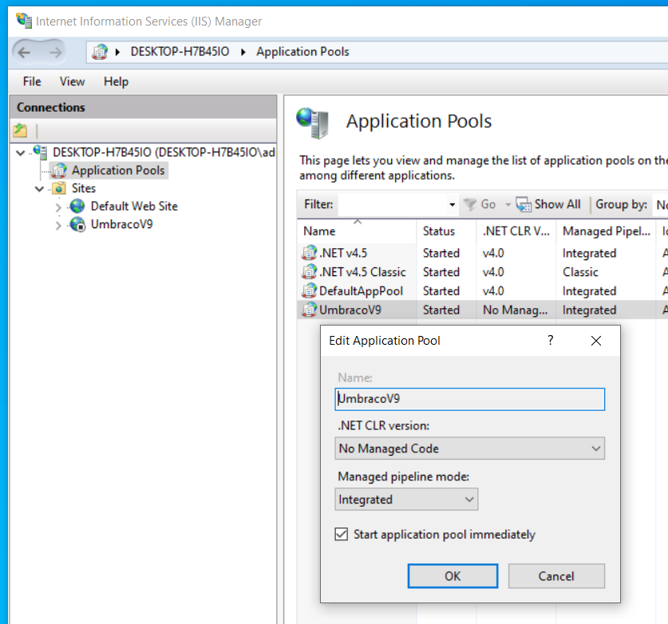
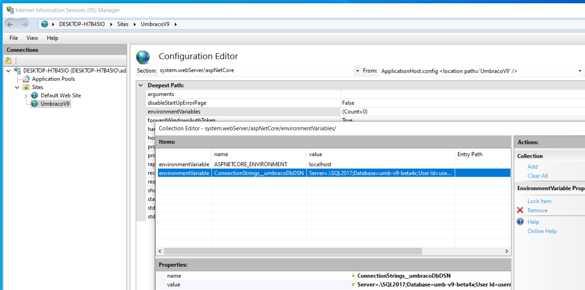

# Hosting Umbraco in IIS

## Configuring IIS for .NET

* Install the [ASP.NET Core Runtime](https://dotnet.microsoft.com/en-us/download/dotnet/7.0) and download the **Hosting Bundle**.
* Restart IIS (`net stop was /y` followed by `net start w3svc`)
* Create a site in IIS and ensure that the .NET Common Language Runtime (CLR) version is set to `No Managed Code` for the Application Pool.



### Publish website for manual deployment to IIS

You can use the dotnet CLI to compile and collate all files required for hosting

```
dotnet publish -o ../deployment-artefacts -f net7.0
```

Alternatively, you can use the File Transfer Protocol (FTP) publishing in Visual Studio to compile and collate all the required files for the application to run.

In Visual Studio, select the Umbraco web project in the _Solution Explorer_ and choose the _Publish..._ command.


### Environment Variables in ApplicationHost.config

In the _Management_ section you find the _Configuration Editor_:


One section is of particular interest:

* In the first, left hand dropdown list (_Section:_) choose: `system.webServer/aspNetCore` section.
* In the second, right hand dropdown list (_From:_) choose: `ApplicationHost.config <location path='[YOUR-SITENAME]'>`. This ensures your settings will be stored in a machine specific file. The configuration files might end in a public repository and should not contain sensitive data like Connection Strings or Simple Mail Transfer Protocol (SMTP) configuration with username and password. Additionally, by default the configuration file will be overwritten during each publish processes.



Find the line named _environmentVariables_ and open the dialog to add environment variables. These work similar to the _launchSettings_. You can define `ASPNETCORE_ENVIRONMENT` and create an `appSettings.[ASPNETCORE_ENVIRONMENT].json` file. Or even better create environment variables for sensitive settings like passwords. There are some differences to `launchSettings.json` configuration:

* Variable names need to change the object structure form JSON by combining the segments with double underscore `__` e.g. `ConnectionStrings__umbracoDbDSN`
* Escaped backslashes `\\` e.g. `serverName\\databaseInstanceName` are replaced by single backslash `\` e.g. `DATABASESERVER123\SQL2017`

### IIS Hosting models

IIS can host .NET applications using 2 different hosting models

* [In-process (default)](https://docs.microsoft.com/en-us/aspnet/core/host-and-deploy/iis/in-process-hosting?view=aspnetcore-7.0)
* In-process hosting runs a .NET app in the same process as its IIS worker process
* [Out-of-process](https://docs.microsoft.com/en-us/aspnet/core/host-and-deploy/iis/out-of-process-hosting?view=aspnetcore-7.0) - to enable this model you need to edit your .csproj file and add:

```js
<PropertyGroup>
  <AspNetCoreHostingModel>OutOfProcess</AspNetCoreHostingModel>
</PropertyGroup>
```

Out-of-process .NET apps run separately from the IIS worker process. The module controls the management of the Kestrel server and requests are proxied between them.
