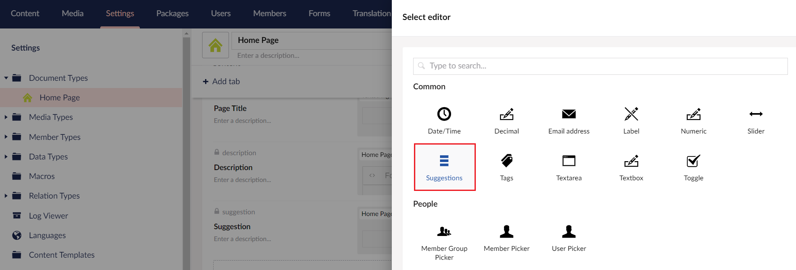

# Creating a Property Editor

This guide explains how to set up a property editor, hook it into Umbraco's Data Types, AngularJS' modules, and its injector, and finally how we can test our property editor.

The steps we will go through in part 1 are:

* [Setting up a Plugin](./#setting-up-a-plugin)
* [Writing basic HTML and JavaScript](./#writing-basic-html-and-javascript)
* [Registering the Data Type in Umbraco](./#registering-the-data-type-in-umbraco)
* [Implementing AngularJS Dependency Injection](./#implementing-angularjs-dependency-injection)

## Prerequisites

This tutorial covers how to use AngularJS with Umbraco, so it does not cover AngularJS itself. To read about AngularJS, you can take a look at some of the resources here:

* [Egghead.io](https://egghead.io/courses/angularjs-fundamentals)
* [Angularjs.org/tutorial](https://docs.angularjs.org/tutorial)
* [Pluralsight](https://www.pluralsight.com/paths/angular-js)

## The End Result

By the end of this tutorial, we will have a suggestion data type running inside of Umbraco, registered as a Data Type in the backoffice, and assigned to a Document Type. The data type can create and suggest values.

## Setting up a plugin

To begin with, let's create a new folder inside `/App_Plugins` folder. We will call it `Suggestions`.

Next, we will create a Package Manifest file to describe what the plugin does. This manifest will tell Umbraco about our new Property Editor and allow us to inject any needed files into the application.

Create the file `/App_Plugins/Suggestions/package.manifest`.

For more information about the package.manifest file, see the [Package Manifest](../../extending/property-editors/package-manifest.md) article.

Inside the `package.manifest` file, we will add the following JSON to describe the Property Editor. Have a look at the inline comments in the JSON below for details on each bit:

```json
{
    // we can define multiple editors
    "propertyEditors": [
        {
            /*this must be a unique alias*/
            "alias": "Suggestions editor",
            /*the name*/
            "name": "Suggestions",
            /*the icon*/
            "icon": "icon-list",
            /*grouping for "Select editor" dialog*/
            "group": "Common",
            /*the HTML file we will load for the editor*/
            "editor": {
                "view": "~/App_Plugins/Suggestions/suggestion.html",
                /*Optional: Add 'read-only' support. Available from Umbraco 10.2+*/
                "supportsReadOnly": true
            }
        }
    ],
     // array of files we want to inject into the application on app_start
    "css": [
        "~/App_Plugins/Suggestions/suggestion.css"
    ],
    "javascript": [
        "~/App_Plugins/Suggestions/suggestion.controller.js"
    ]
}
```

## Setting up a Property Editor with Csharp

You can also create a property editor with C# instead of defining it in a `package.manifest`. Create a `Suggestion.cs` file in `/App_Code/` to register the editor this way.

```csharp
using Umbraco.Cms.Core.IO;

namespace Umbraco.Cms.Core.PropertyEditors
{
    [DataEditor(
        alias: "Suggestions editor",
        name: "Suggestions",
        view: "~/App_Plugins/Suggestions/suggestion.html",
        Group = "Common",
        Icon = "icon-list")]
    public class Suggestions : DataEditor
    {
        public Suggestions(IDataValueEditorFactory dataValueEditorFactory)
            : base(dataValueEditorFactory)
        {            
        }
    }
}
```

You will still need to add all of the files you added above but, because your `C#` code is adding the Property Editor, the `package.manifest` file can be simplified like this:

```json
{
    // array of files we want to inject into the application on app_start
    "css": [
        "~/App_Plugins/Suggestions/suggestion.css"
    ],
    "javascript": [
        "~/App_Plugins/Suggestions/suggestion.controller.js"
    ]
}
```

## Writing basic HTML and JavaScript

Now, we will add 3 files to the /App\_Plugins/Suggestions/ folder:

* `suggestion.html`
* `suggestion.controller.js`
* `suggestion.css`

These will be our main files for the editor, with the `.html` file handling the view, `.js` file handling the functionality and the `.css` file containing the stylesheet.

In the `.html` file we'll add:

```html
<div class="suggestion" ng-controller="SuggestionPluginController">
    <p>{{model.value}}</p>
    <input type="text" ng-model="model.value" />
    <button type="button"> Give me Suggestions!</button>
</div>
```


**Optional**

Add `ng-readonly="readonly"` to the `input` tag in order to make the property editor _read-only_.


In the `.js` file, we'll add a basic AngularJS controller declaration

```javascript
angular.module('umbraco').controller('SuggestionPluginController', function () {
        alert("The controller has landed");
    });
```

In the `.css` file, we'll add:

```css
.suggestion {
    cursor: pointer;
    text-align: left;
    font-size: 20px;
    color: Highlight;
}
```

Now our basic parts of the editor are done, namely:

* The package manifest, telling Umbraco what to load
* The HTML view for the editor
* The controller for wiring up the editor with angular
* The stylesheet for defining our data type styles

## Registering the Data Type in Umbraco

We will now restart our application. In the Document Type, let's add our newly added property editor "Suggestions" and save it.



Now open the content item of that Document Type and there will be an alert message saying "The controller has landed", which means all is well.


We can now edit the assigned property's value with our new property editor.

## Implementing AngularJS Dependency Injection

Now, open the `suggestion.controller.js` file and edit it so it looks like this:

```javascript
angular.module("umbraco")
.controller("SuggestionPluginController",
// Scope object is the main object which is used to pass information from the controller to the view.
    function ($scope) {

    // SuggestionPluginController assigns the suggestions list to the aSuggestions property of the scope
   $scope.aSuggestions = ["You should take a break", "I suggest that you visit the Eiffel Tower", "How about starting a book club today or this week?", "Are you hungry?"];

    // The controller assigns the behavior to scope as defined by the getSuggestion method, which is invoked when the user clicks on the 'Give me Suggestions!' button.
    $scope.getSuggestion = function () {

        // The getSuggestion method reads a random value from an array and provides a Suggestion. 
        $scope.model.value = $scope.aSuggestions[$scope.aSuggestions.length * Math.random() | 0];

    }

});
```


Visit the [Property Editors page](../../extending/property-editors/) for more details about extending this service.


and add that id to the button in the HTML:

```html
<div class="suggestion" ng-controller="SuggestionPluginController">
    <p>{{model.value}}</p>
    <input type="text" ng-model="model.value" />
    <button type="button" ng-disabled="getState()" ng-click="getSuggestion()"> Give me Suggestions!</button>
</div>
```

Now, clear the cache, reload the document, and see the Suggestions Data Type running.


When we save or publish, the value of the Data Type is automatically synced to the current content object and sent to the server, all through the power of Angular and the `ng-model` attribute.

Learn more about extending this service by visiting the [Property Editors page](../../extending/property-editors/).
