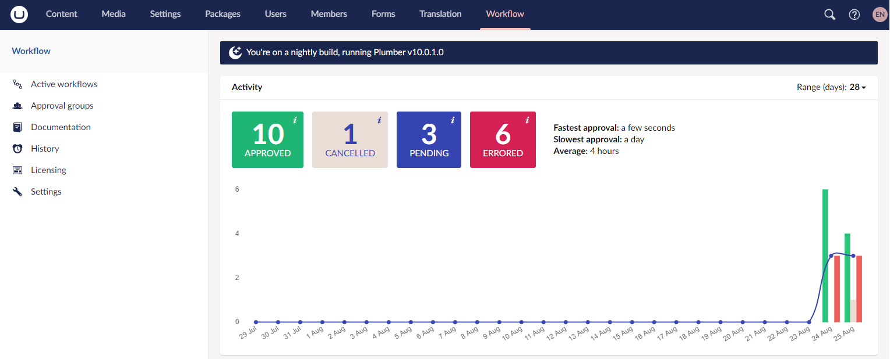

# Dashboards and Buttons

Umbraco Plumber has its default Dashboards. By default, when you install Umbraco Plumber, you receive two Dashboards: the *User Dashboard* and the *Admin Dashboard*. Additionally, Umbraco Plumber replaces the default Umbraco button set in the editor drawer.

## Dashboards

Umbraco Plumber adds two Dashboards to your Umbraco project:

- **User Dashboard** - This Workflow Dashboard is added in the **Content** section. It displays the current user’s submissions and tasks requiring approval from the user.

  

- **Admin Dashboard** - This Workflow Dashboard is the default view in the **Workflow** section. It displays a chart of recent workflow activity and any relevant upgrade-related messages. You can also set the days to view the workflow activity chart for the specified range of days.

  

## Buttons

When a workflow is active on the current node, the **Publish** button is replaced, linking to the workflow content app.

When no workflow is active, the button state is determined by the current user's permissions.

Umbraco Plumber overrides Umbraco's User/Group publishing permissions. If the user has permission to update the node, they will be able to initiate a workflow process on that node. Umbraco Plumber shifts Umbraco from a centrally administered publishing model (i.e. controlled by a site administrator) to a distributed model, where editors publish content based on their responsibilities assigned during the workflows.

In cases, where the content is already in a workflow, a notification is displayed at the top of the editor. Depending on the Workflow **Settings**, you can enable/disable editing access on a content node in a workflow.

For nodes where the workflow has been disabled, the default Umbraco options are displayed.

