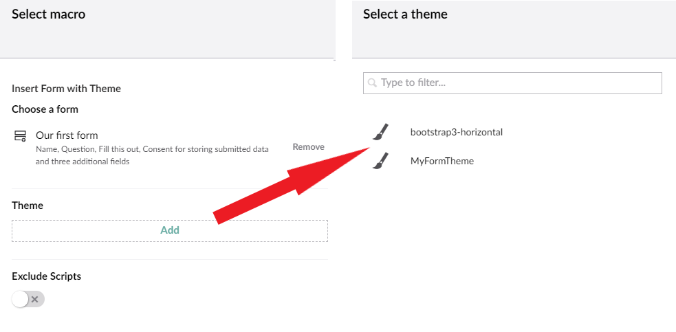

# Themes

As of version 6.0.0 and newer Umbraco Forms supports Themes, allowing forms to be customised in a much simpler manner than found in version 4.x.

## Creating a Theme

To create a theme, you need to create a folder at `/Views/Partials/Forms/Themes/`. The name of the folder is the name of theme that will be visible in the backoffice when choosing it.

Copy the explicit files you wish to override in your theme, it may be a single file or all files from the default theme folder. Make the necessary changes you desire to CSS class names, markup etc.

For Umbraco 9 and previous, it's straightforward to simply copy the files you need from the default theme folder.  Umbraco 10 distributes these files as part of a Razor class library, so you won't find them on disk. The easiest way to obtain copies of the files included in the default theme is to [download this zip file](https://our.umbraco.com/FileDownload?id=23911) and extract the ones you need.

:::note
Umbraco Forms conditional JavaScript logic depends on some CSS classes currently and it is advised that you add any additional classes you require but **do not remove those already being set**.
:::

When using your own theme, you need to copy the `Script.cshtml` file from the `default` themes folder and amend the js references to reference your own js files. Your js files are probably best located in `/js` or `/scripts` along with your other js files. You can't put these in `/Views` since they won't be served because of restrictions on that folder by the web.config file.

We highly recommend you never customize any files found in the `default` themes folder, as any customizations to these files will most likely be lost with any future upgrades you do to Umbraco Forms.

## Using a Theme

To use a theme with a Form use the "Insert Form" macro where you will be presented with the options of the form you wish to insert along with an option to pick a theme. This displays the list of theme folders found at `Views/Partials/Forms/Themes`.



When you are rendering your form directly in your template, you need to specify your theme by filling out the `FormTheme` attribute:

```csharp
@await Umbraco.RenderMacroAsync("renderUmbracoForm", new {FormGuid="1ec026cb-d4d3-496c-b8e8-90e0758c78d8", FormTheme="MyFormTheme", ExcludeScripts="0"})
```

If you do not pick and/or set a theme, the `default` theme will be used to render the form.

## Theme Fallbacks

When using a theme, Umbraco Forms will try to use a view from the theme folder, but then fallback to the same view in the default theme folder if it can't be found. This allows you to create a theme by only modifying the files necessary to make your customizations.

Files which can be overridden:

* Render.cshtml (overrides the entire form - usually not needed)
* Form.cshtml (overrides the generation of the fields on the current page)
* Script.cshtml (overrides the way files are included with the form)
* /Fieldtypes/FieldType.*.cshtml (overrides a specific view for a field)

## Helper Methods

### SetFormThemeCssFile

Sets the primary form theme stylesheet path. This overrides an already assigned stylesheet and will be rendered out when inserting the form into the page

```csharp
Html.SetFormThemeCssFile(Model, "~/App_Plugins/UmbracoForms/Assets/Themes/Default/style.css")
```

### AddFormThemeScriptFile

Add a JavaScript file path to include on form render

```csharp
Html.AddFormThemeScriptFile("~/App_Plugins/UmbracoForms/Assets/themes/default/umbracoforms.js");
```

### SetFormFieldClass

Adds a class to the form field HTML element of a given type. If no type is given, it will add the class to all fields

```csharp
// Applies the CSS class 'form-control' to all fields that GetFormFieldClass uses in FieldType views
@Html.SetFormFieldClass("form-control")

// Applies the CSS class 'some-other-class' for the FieldType of the name 'Password'
@Html.SetFormFieldClass("some-other-class", "Password")
```

### GetFormFieldClass

Retrieves all classes for a given field type, used when rendering form fieldtype partial views

```csharp
class="@Html.GetFormFieldClass(Model.FieldTypeName)"
```

### SetFormFieldWrapperClass

Adds a class to the div element wrapping around form fields of a given type. If no type is given, it will add the class to all fields

```csharp
// Applies the CSS class 'form-group' around all fields, labels & help texts
@Html.SetFormFieldWrapperClass("form-group")

// Applies the CSS class 'some-other-class' for the FieldType of the name 'Password'
@Html.SetFormFieldWrapperClass("some-other-class", "Password")
```

### GetFormFieldWrapperClass

Retrieves all wrapper classes for a given field type, used when rendering form fields. This class wraps both label, help-text and the field itself in the default view

```csharp
class="@Html.GetFormFieldWrapperClass(f.FieldTypeName)"
```

---

Prev: [Rendering Forms Scripts](../Rendering-Scripts/index.md) &emsp; &emsp; &emsp; &emsp; &emsp; &emsp; &emsp; &emsp; Next: [Custom Markup](../Custom-Markup/index.md)
