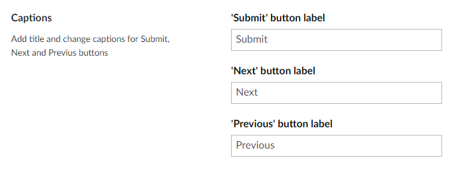

# Form settings

In this article you can read more about how you can customize your form.

## Store records (version 7+)

By default all submitted records will be stored to the database. This can be changed by un-checking the **Store records** option.

## Captions

Customize that buttons and labels used in your form.

## Styling

Set a **css class** to give your form custom styling. You can also disable the default styling, and chose whether to load assets with client dependencies.

### Disable default stylesheet

Enabling this option will prevent a default stylesheet being added to the pages where the form is placed.

## Validation

Define the message that is displayed when a field is mandatory, when a value isn't supplied or when the value is invalid.

### Mandatory error message

The error message that will be displayed for a field if it is marked as mandatory but a value has not been provided upon submission. This setting can be overwritten on a field level. `{0}` will be replaced with the field caption.

### Invalid error message

The error message that will be displayed for a field if the value provided is not valid (a regular expression has been setup but the input does not match). This setting can be overwritten on a field level. `{0}` will be replaced with the field caption.

### Show validation summary

Enable this option if you wish to display a summary of all error messages on top of the form.

### Hide field validation labels

Enable this option if you wish the hide individual field error messages from being displayed.

### Mark fields

You can choose to not mark any fields or only mark mandatory or optional fields.

### Indicator

Choose which indicator to use when a field has been marked as mandatory. The default indicator is `*`.

### Moderation

Allow form submissions to be post moderated. Most use cases are for publicly shown entries such as blog post comments or submissions for a social campaign.

