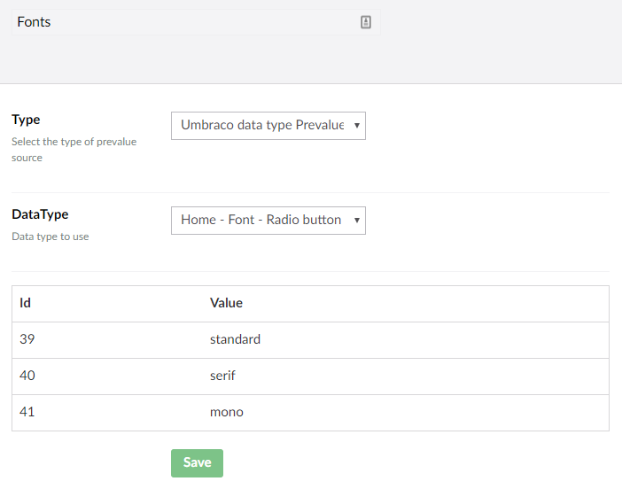
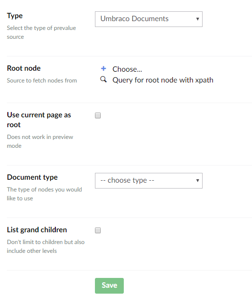

# Overview of the default prevalue source types

There are some default prevalue source types that can be used. For each prevalue source you setup, a `json` file will be generated in `~/App_Data/UmbracoForms/Data/prevaluesources`.

Here is a quick overview of the default types:

## Get values from textfile

Upload a textfile that contains the prevalues. Each prevalue should have its own line in the file.

Once the file has been uploaded, you can find it in `~/App_Data/UmbracoForms/Data/PreValueTextFiles`.

## SQL Database

With this type you can connect to a OleDB compatible database table and construct a prevalue source from it. Once selected it will be editable from the forms UI.

For this type you will need to configure the following:

* Connection string (either choose one from your web.config or add another from a textfield)
* Table Name
* Key Column
* Value Column

## Umbraco data type Prevalues

Choose an Umbraco data type to use its configured prevalue collection.

In the example below I am using the prevalue collection from a data type called `Home - Font - Radio button`:

## Umbraco Documents

This type lets you use content nodes from a specific source as prevalues.

You can define the root node by either

* Choose a node directly from the Content tree or
* Using XPath

Additional settings can be applied:

* Choose to **Use current page as root** instead of selecting a specific root node - Note that preview isn't available with this enabled
* Select a specific **Document type**, if the selected root node contains different types
* Choose to include **Grand children** of the selected root node
