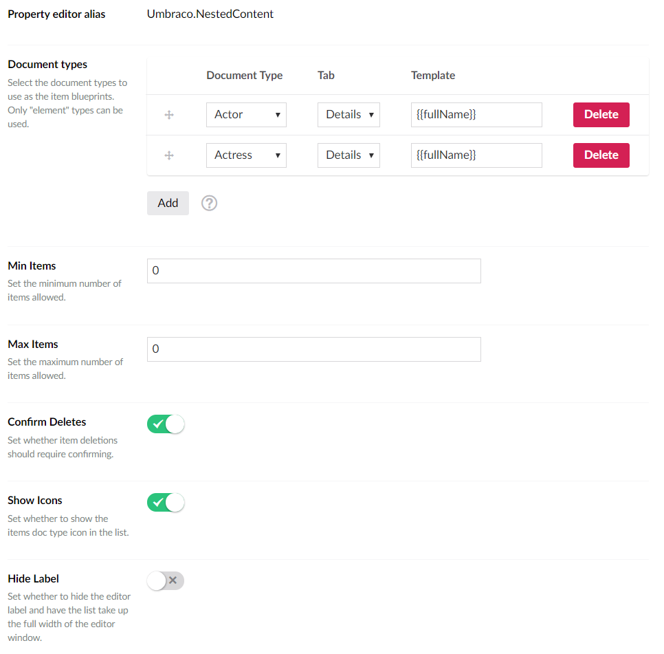
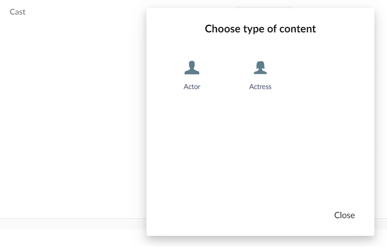
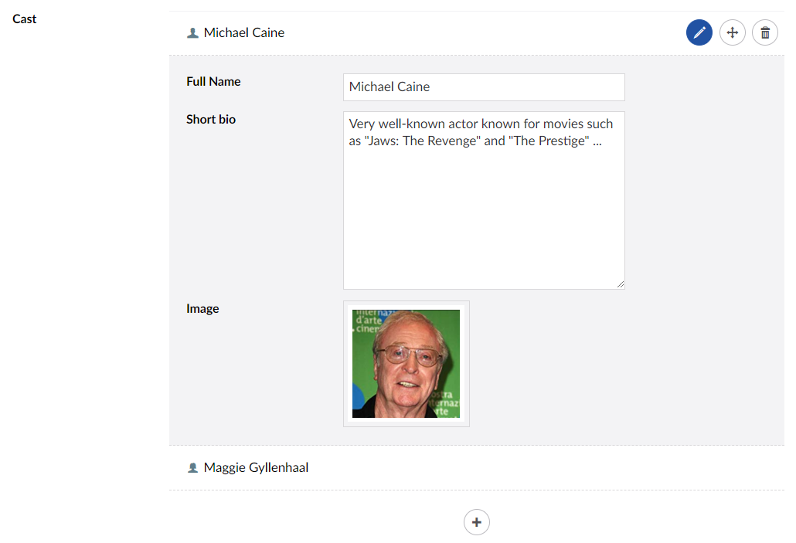
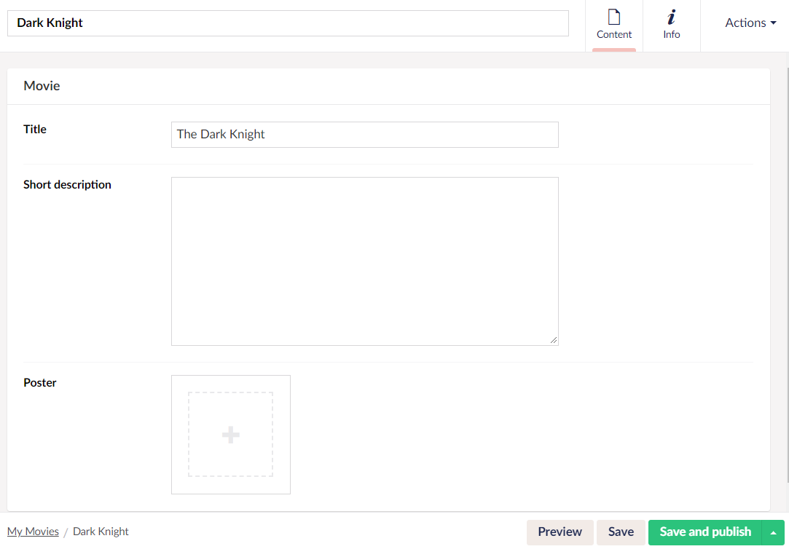

# Nested Content

`Alias: Umbraco.NestedContent`

`Returns: IEnumerable<IPublishedElement>` (or `IPublishedElement` depending on configuration)


**Nested Content** is a list editing property editor, using Document Types to define the list item schema. By using document-types, you have the benefit of a reusable UI that you are familiar with and get to re-use all the standard data-types as field editors. This property editor returns either a single item or a collection of this document-type.

## Configuring Nested Content

The **Nested Content** property editor is set-up/configured in the same way as any standard property editor, via the *Data Types* admin interface. To set-up your Nested Content property, create a new *Data Type* and select **Nested Content** from the list of available property editors.

You should then be presented with the **Nested Content** property editors data-type editor as shown below.



The data-type editor allows you to configure the following properties:

- **Doc Types** - Defines a list of document-types to use as data blueprints for this **Nested Content** instance. For each document-type you can provide the alias of the group you wish to render (the first group is used by default if not set) as well as a template for generating list item labels using the syntax `{{propertyAlias}}`.
    - If you would like to include the document type name in the label, you can use `{{alias}}`.
    - If you would like to include the index position in the label, you can use `{{$index}}`.
    - If your property links to a content, media or member node, you can use the Angular filter `{{ pickerAlias | ncNodeName }}` to show the node name rather than the node ID.
    - If your property is a rich text editor, you can use the Angular filter `{{ pickerAlias | ncRichText }}` to show the unformatted text.
    - You can use conditional logic to show text instead of 1 or 0 for a true/false property: `{{checkboxPickerAlias == 1 ? 'Yes' : 'No'}}`.
    - For more complex property types, you can display specific attributes by referencing the JSON attribute. For example, if using the MultiUrlPicker, show the name of the first link using `{{urlPickerAlias[0]["name"]}}`.
- **Min Items** - Sets the minimum number of items that should be allowed in the list. If greater than `0`, **Nested Content** will pre-populate your list with the minimum amount of allowed items and prevent deleting items below this level. Defaults to `0`.
- **Max Items** - Sets the maximum number of items that should be allowed in the list. If greater than `0`, **Nested Content** will prevent new items being added to the list above this threshold. Defaults to `0`.
- **Confirm Deletes** - Enabling this will demand item deletions to require a confirmation before being deleted. Defaults to `true`.
- **Show Icons** - Enabling this will display the item's doc type icon next to the name in the **Nested Content** list.
- **Hide Label** - Enabling this will hide the property editor's label and expand the **Nested Content** property editor to the full width of the editor window.

Once your data type has been configured, set-up a property on your page doc type using your new data type and you are set to start editing.


## Editing Nested Content

When viewing a **Nested Content** editor for the first time, you'll be presented with an icon and help text to get you started.


Click the plus icon to start creating a new item in the list.

If your **Nested Content** editor is configured with multiple document-types you will be presented with a dialog window to select which document-type you would like to use.



Click the icon of the document-type you wish to use and a new item will be created in the list using that document-type.

If you only have one document-type configured for your **Nested Content** editor, then clicking the plus icon will not display the dialog and instead will jump straight to inserting an entry in the editor for you ready to edit.



More items can be added to the list by clicking the plus icon for each additional item.

To close the editor for an item or open the editor for another item in the list, you click the edit icon.


To reorder the list, click and drag the move icon up and down to place the items in the order you want.

To delete an item click the delete icon. If the minimum number of items is reached, then the delete icon will appear greyed out to prevent going below the minimum allowed number of items.


### Single Item Mode

If **Nested Content** is configured with a minimum and maximum item of 1, then it goes into single item mode.

In single item mode, there is no icon displayed to add new items, and the single items editor will be open by default and its header bar removed.

In this mode, **Nested Content** works more like a fieldset than a list editor.




## Rendering Nested Content

To render the stored value of your **Nested Content** property, a built in value converter is provided for you. Call the `Value<T>` method with a generic type of `IEnumerable<IPublishedElement>` and the stored value will be returned as a list of `IPublishedElement` entities.

Example:

```csharp
@inherits Umbraco.Cms.Web.Common.Views.UmbracoViewPage<ContentModels.YourDocumentTypeAlias>
@{
    var items = Model.Value<IEnumerable<IPublishedElement>>("nest");

    foreach (var item in items)
    {
        // Render your content, e.g. item.Value<string>("heading")
    }
}
```

Each item is treated as a standard `IPublishedElement` entity, which means you can use all the value converters you are used to using.

Example:

```csharp
@inherits Umbraco.Cms.Web.Common.Views.UmbracoViewPage<ContentModels.YourDocumentTypeAlias>
@using Umbraco.Cms.Core.Models.PublishedContent;
@using ContentModels = Umbraco.Cms.Web.Common.PublishedModels;
@{
    var items = Model.Value<IEnumerable<IPublishedElement>>("nest");

    foreach (var item in items)
    {
        var description = item.Value<string>("description");
        var image = item.Value<IPublishedContent>("image");

        <h3>@item.Value("heading")</h3>

        if (!string.IsNullOrEmpty(description))
        {
            <p>@description</p>
        }

        if (image != null)
        {
            
        }
    }
}
```

#### Single Item Mode

If your **Nested Content** property editor is configured in single item mode, then the value converter will automatically know this and return a single `IPublishedElement` entity rather than an `IEnumerable<IPublishedElement>` list. Therefore, when using **Nested Content** in single item mode, you can call `Value<T>` with a generic type of `IPublishedElement` and you can start accessing the entity's properties straight away, rather than having to then fetch it from a list first.

Example:

```csharp
@inherits Umbraco.Cms.Web.Common.Views.UmbracoViewPage<ContentModels.YourDocumentTypeAlias>
@using Umbraco.Cms.Core.Models.PublishedContent;
@using ContentModels = Umbraco.Cms.Web.Common.PublishedModels;
@{
    var item = Model.Value<IPublishedElement>("myPropertyAlias");
}
<h3>@item.Value("heading")</h3>
```

## Creating Nested Content programmatically

For the sake of this example, let us assume we have a Nested Content property with alias `attendeeList`, where the element Document Type has an alias of `attendee`.
It has the Properties: `user_name`, `user_email`, `join_time`, `leave_time`, `duration`, `phone`.

To save data in Nested Content, we need to create a new C# List containing a `Dictionary` of type `<string, object>`. `Dictionary<string, string>` would also work.
The first dictionary item property/parameter we should specify for each Nested Content element is `ncContentTypeAlias`, which is the alias of the Document Type that we have nested.

Afterwards, the entire list needs to be serialized to Json via JsonConvert.

```csharp
@using Umbraco.Cms.Core.Models;
@using Umbraco.Cms.Core.Services;
@using Newtonsoft.Json;
@inject IContentService _contentService;

 //if the class containing our code inherits SurfaceController, UmbracoApiController, 
 //or UmbracoAuthorizedApiController, we can get ContentService from Services namespace
 var contentService = _contentService; 
//here we create a new node, and fill out attendeeList afterwards
 IContent request = contentService.Create("new node", guid, "mydoctype", -1); 
 //our list which will contain nested content
 var attendees = new List<Dictionary<string, string>>(); 
//participants is our list of attendees - multiple items, good use case for nested content
 foreach (var person in participants) 
            attendees.Add(new Dictionary<string, string>() {
            //this is the only "default" value we need to fill for nested item
            {"ncContentTypeAlias","attendee"}, 
            {"user_name", person.name},
            {"user_email",person.user_email},
            {"join_time",person.join_time.ToString()}, 
            //we convert some properties to String just to be on the safe side
            {"leave_time",person.leave_time.ToString()},
            {"duration",person.duration.ToString()},
            {"phone",person.phone.ToString()}
            });
            }
            //bind the attendees List to attendeeList property on the newly created content node
            request.SetValue("attendeeList", JsonConvert.SerializeObject(attendees)); 
            //Save the entire node via ContentService
            ContentService.SaveAndPublish(request); 
```

In the above sample we iterate through a list of participants (the data for such participants could be coming from an API, for example), and add a new `Dictionary` item for each person in the list.
