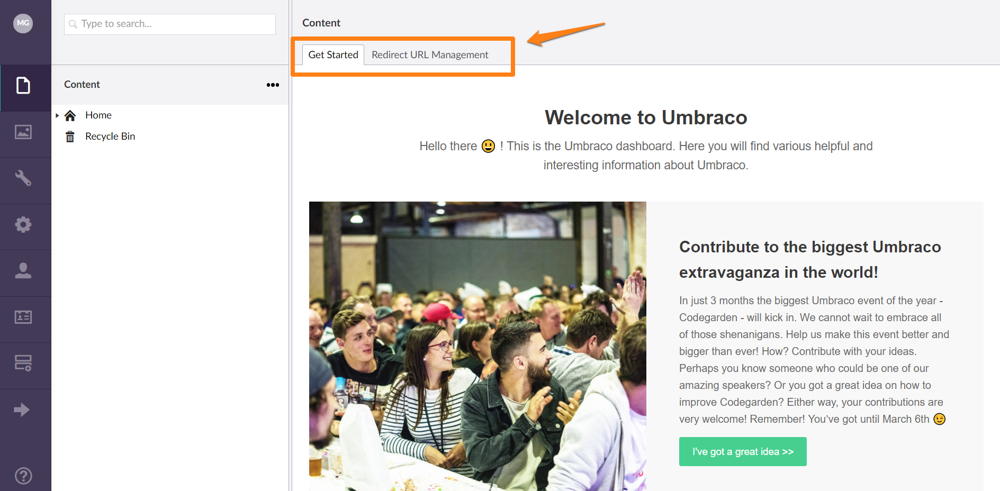
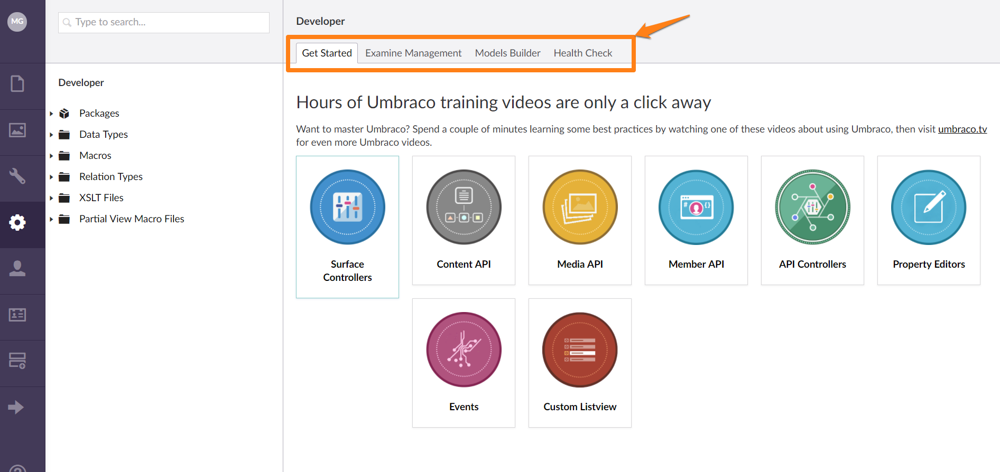
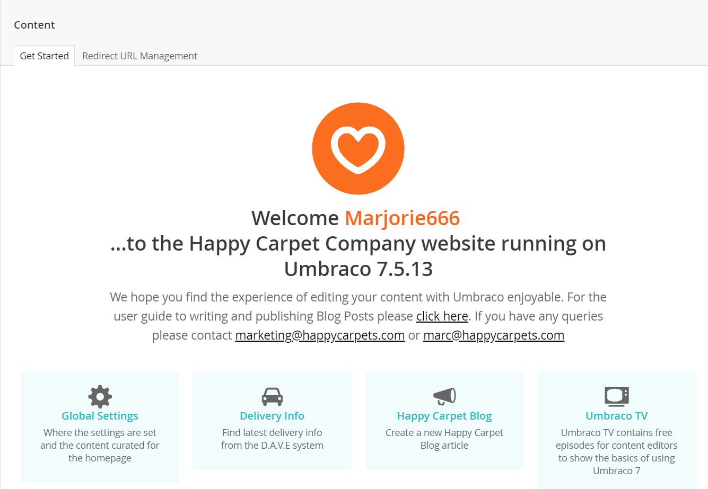
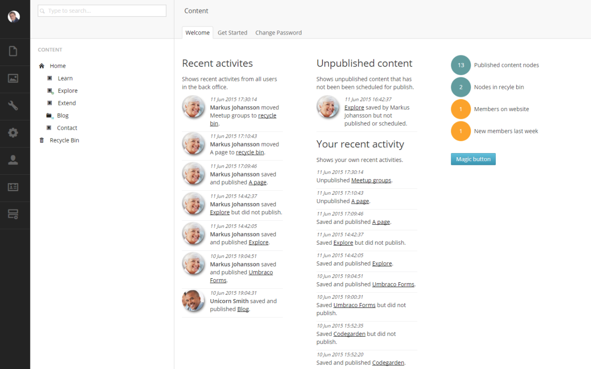

# Dashboards

Each section of the Umbraco backoffice has its own set of default dashboards.

The dashboard area of Umbraco is used to display the current editor for whichever item is selected in the tree, but when no items are selected, for example when the section first loads, that's when the default set of dashboards are displayed for that section, arranged over multiple tabs.

In the above screenshot you can see the default set of dashboards for the Content section. For most users these will be: 'Get Started' and 'Redirect Url Management'. In the screenshot below, the Developer section has 'Get Started', 'Examine Management', 'Models Builder' and 'Health Check'.

The different sections, dashboards and their configuration (sort order and users rights) are all configured in the [/config/dashboards.config](../../Reference/Config/dashboard/index.md) file.

## Configuration Example

	<?xml version="1.0" encoding="utf-8" ?> 
	<dashBoard> <!-- Root of the dashboard XML tree -->
	   <section>  <!-- Defines a dashboard layout for a group of sections -->
	        <areas> <!-- Declares which sections (i.e. content,media,users,[your own]-->
                <area>[area name]</area> <!-- A section to apply this to eg 'content' -->
                ...
	        </areas>
	
	        <tab caption="[caption]"> <!-- Creates a tab in the Dashboard with the assigned caption -->
				<access><!-- control which Umbraco roles can see the tab -->
					<deny>translator</deny>
                  <grant>editor</grant>
				</access>
                <control>[path]</control> <!-- path AngularJS View (v7) to load into the tab -->
	        </tab>
	        ...
	   </section>
	   ...
	</dashBoard>

[More on Configuring Dashboards](../../Reference/Config/dashboard/index.md)

## Custom Dashboards

Additionally You can create your own custom dashboards, for extending Umbraco with single page AngularJS applications, or to support your site implementation - it is considered 'good practice' to create a custom Welcome Dashboard for your Umbraco implementation to support the day-to-day activities of editors using the Umbraco backoffice with 'quick links' and 'site statistics/information'.

[Check out our Creating a Custom Dashboard tutorial](../../Tutorials/Creating-a-Custom-Dashboard/index.md)

## Package Dashboards

There are lots of packages listed on <a href="/projects/?category=Backoffice%20extensions">our umbraco</a> that provide custom dashboard functionality.

For example, the snappily titled <a href="/projects/backoffice-extensions/the-dashboard/">'The Dashboard'</a> provides great information for editorial teams on what has been edited recently and by whom.

