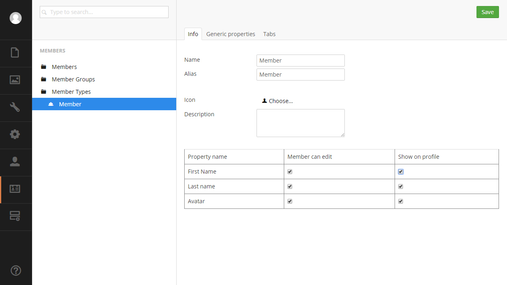
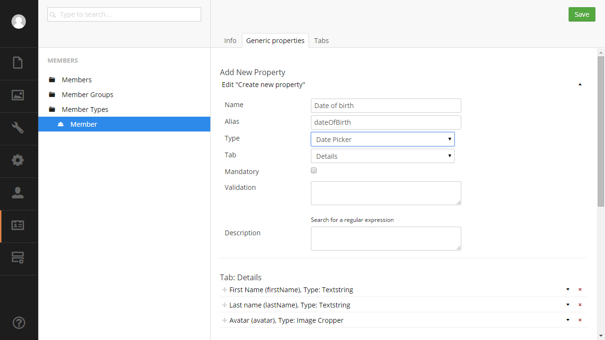
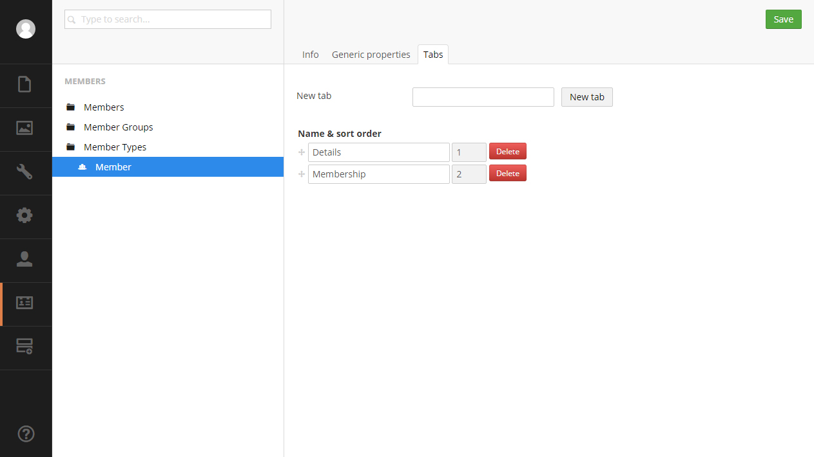
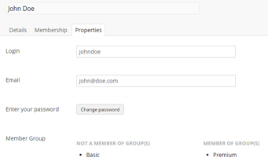

# Members

Members are used for registering and authenticating external users of an Umbraco installation (ie. forum members, intranet users and so forth).

Unlike with Document Types and Media Types everything is done in the Members section both defining and creating, and editing members. This guide will explain how to define and create members in the backoffice. If you want to work with members using the service APIs, links can be found at the end of the document.

There is a default Member Type that can be used to create members. You can customize this to fit your needs or create your own Member Type from scratch.

## Creating a Member

Go to the __Members__ section, click the menu icon next to __Members__ in the member tree and select __Member__. Members have a number of mandatory properties. So aside from filling out the name, you will need to fill out  __Login__, __Email__ and __Password__ on the __Properties__ tab before the member can be saved.

There is also a number of default properties on the __Membership__ tab:

- `umbracoMemberComments`
- `umbracoMemberFailedPasswordAttempts`
- `umbracoMemberApproved`
- `umbracoMemberLockedOut`
- `umbracoMemberLastLockoutDate`
- `umbracoMemberLastLogin`
- `umbracoMemberLastPasswordChangeDate`

Once the Member is created and saved you can access it by expanding the Members tree and clicking __All Members__ to get a list view (with real-time search). You can also select the member type to filter by in the Members tree.

## Creating a Member Type

You can create your own Member Types and add properties and tabs as you would with Document Types.

Go to the __Members__ section, click the menu icon next to __Member Types__ and select __Create__. Name the new Member Type and click the __Create__ button.

You will now be taken to the Member Type editor that is used to define and edit the Member Type. It consists of three tabs: __Info__, __Generic Properties__ and __Tabs__.

### Info

Shows basic information about the Member Type and settings for custom properties.

__Name:__ The name of the Member Type shown in the Member Type tree when users create a new member.

__Alias:__ Used to reference the Member Type in code.

__Icon:__ The icon shown in the Members list view. If there is more than one Member Type, choosing different icons will help identify members.

__Description:__ The description shown when creating a new member.

__Property settings:__ If properties are added to the Member Type you can control frontend access to the property:

- __Member can edit:__ A logged in member can edit this property.
- __Show on profile:__ The property will show on the profile of the member that is logged in.

### Generic Properties

Create, edit, and organize properties for the Member Type.

#### Adding properties

To add a property to the Member Type select __Click here to add new property__.

__Name:__ The name of the property.

__Alias:__ Used to reference the property in your templates.

__Type:__ Selecting the type will decide the input method for this property (i.e. *Richtext editor*, *Date Picker*, *Image Cropper* and so forth). You can edit or create new types in the __Developer Section__ under the __Data Type__ node.

__Tab:__ Place the property on a tab. Additional tabs can be created on the __Tabs__ tab. If the property is placed on the Generic Properties tab it will show on the Properties tab in the content view.

__Mandatory:__ Making the property mandatory means the content cannot be created/saved if the property has no value.

__Validation:__ Add a regular expression to validate the property upon saving.

__Description:__ The description will be displayed below the property name when creating/editing the member. A good description is important to the editing experience.

##### Organizing properties

Organize properties with drag and drop. If multiple tabs exist it is possible to drag properties between the different tabs.

### Tabs

A new tab is created by entering a name into the input field and pressing the __New tab__ button.

#### Name and sort order

Renaming a tab is done by changing the name in the input field and saving the Document Type. To change the order of the tabs use the drag and drop handle to the left or enter a numeric value in the second input field. Tabs will be displayed from left (lowest value) to right (highest value) in the content section.

## Creating Member Groups

Member Groups define roles for your members that can be used for role-based protection. A member can be in multiple groups.

To create a new Member Group click the menu icon next to the __Member Groups__ node in the Members section. Choose __Create__, name the group, and save the group.

### Assigning a Member Group

To assign a member to a specific group find the member you wish to assign and go to the __Properties__ tab. Under the Member Group property there are two columns:

__NOT A MEMBER OF GROUP(S):__ Lists all the groups that the member is not a part of. To assign a group to the member click it and it will move to the other column.

__MEMBER OF GROUP(S):__ Lists all the groups that the member is a part of. To remove the member from a group click it and it will move to the other column.

## [Sensitive data](../../../Reference/Security/Sensitive-data-on-members/index.md)

Umbraco 7.9.0 provides the ability to mark members as sensitive. A sensitive member's data will not be displayed to backoffice users unless they have appropriate permissions.

More information can be found under [security](../../../Reference/Security/Sensitive-data-on-members/index.md).

## Technical

As a developer you are able to leverage your website when you build on the Members section of Umbraco.
Although the Members section is by default in the Umbraco backoffice, you will be able to implement some work on the front end of your website.
Members come from a custom ASP.NET membership provider, while Member Groups come from a custom Role provider. Both are defined in the web.config.
You can find out more about the services methods in the reference section of the documentation by following the links below.

### More information

- [Customizing Data Types](../Data-Types/)

### Related Services

- [MemberService](../../../Reference/Management/Services/MemberService/index.md)
- [MemberType Service](../../../Reference/Management/Services/MemberTypeService/index.md)
- [MemberGroup Service](../../../Reference/Management/Services/MemberGroupService/index.md)

### [Umbraco.TV](https://umbraco.tv)

- [Chapter: Members](https://umbraco.tv/videos/umbraco-v7/content-editor/administrative-content/members/what-is-a-member/)
- Member API chapter *(Coming soon)*
