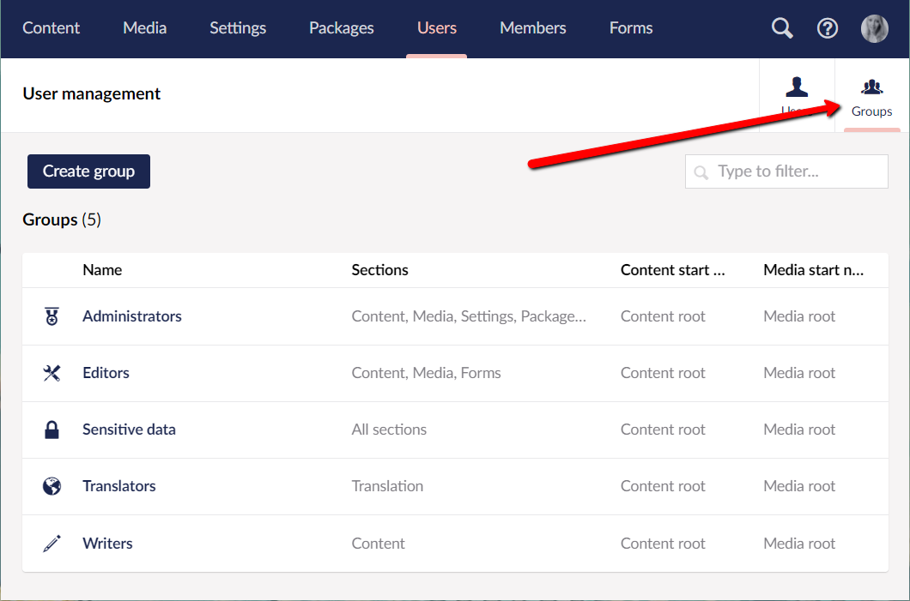
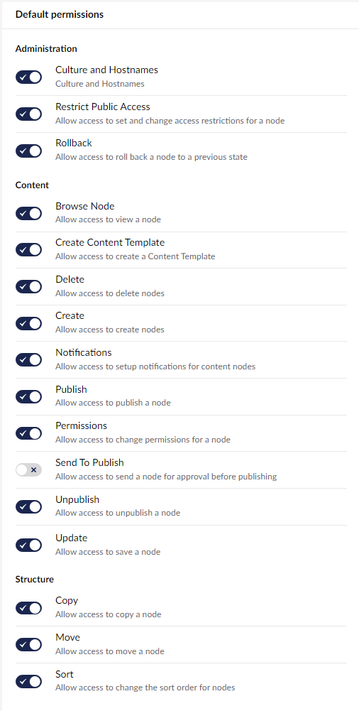

# Users

Users (not to be confused with [Members](../Members)) are people who have access to the Umbraco backoffice. These could include Content Editors, Translators, Web Designers, and Developers.

This guide will explain how to define, create, and manage users in the backoffice.

## Creating a user

Go to the **Users** section. Here, you will see an overview of all the current backoffice users.

To create a new user select the **Invite user** button. You will be prompted to add a **Name** and an **Email** for the new user. You will also need to select which **User group** the new user should be added to and enter a **Message** for the invitation.

Once you've created the user, an autogenerated password will be provided. This password needs to be used to access the account.

### User profiles

There is a number of default properties on every user that can be defined:

- Change/Remove photo
- Change Password (provides option to set a new password)
- Disable (allows one to disable service access)
- Update the email for the user
- Language (sets language of user account)
- User Group (determines scope of access in the backoffice)
- Start nodes for both Content and Media sections to limit the access

## Default User Groups

By default, the User groups available to new users are **Administrators**, **Writers**, **Editors**, **Translators** and **Sensitive Data**.

- **Administrator**: Can do anything when editing nodes in the content section (has all permissions).
- **Editor**: Allowed to create and publish content items or nodes on website without approval from others or restrictions (has permissions to **Public Access**, **Rollback**, **Browse Node**, **Create Content Template**, **Delete**, **Create**, **Publish**, **Unpublish**, **Update**, **Copy**, **Move** and **Sort**).
- **Writer**: Allowed to browse nodes, create nodes, and request for publication of items. Not allowed to publish directly without someone else's approval like an Editor (has permissions to **Browse Node**, **Create**, **Send to Publish** and **Update**).
- **Translator**: Allowed to browse and update nodes as well as grant dashboard access. Translations of site pages must be reviewed by others before publication (has permissions to **Browse Node** and **Update**).
- **Sensitive data**: Any users added to this User group will have access to view any data marked as sensitive. Learn more about this feature in the [Sensitive Data](../../../Reference/Security/Sensitive-data/) article.

## Creating a User Group

:::note
When creating a custom user group, remember to set a start node for content for the user group. If you don't assign a start node then users assigned to the user group will not be able to login to the backoffice.
:::

You can also create your own custom User Groups and add properties and tabs as you would with Document Types and Member Types.

Go to the **Users** section and select the **Groups** tab in the top-right corner.

Select **Create group** and you will be taken to the **User Group** editor. Here you can define and edit the User Group through custom settings and properties.

### User Group Parameters

Shows basic information about the User Group and settings for custom properties.

- **Name**: The name of the User Group shown in the User Group tab.
- **Alias**: Used to Reference the User Group in code - the alias will be auto-generated based on the name.
- **Assign access**: Define which sections the users in the group will have access to, and if the users should have access to only some content / media that is also defined here.
- **Default Permissions**: Selects the default permissions granted to users of the User Group.
- **Granular permissions**: Define a specific node the users in the group should have access to.
- **Users**: Add users to the new group.

## User Permissions

Depending on which User group a user is added to, each User has a set of permissions associated with their accounts. These permissions either enable or disable a user's ability to perform its associated function.

The available user permissions are defined under **Default Permissions** in the User group.

### Setting User Permissions

When a new user is created, you can set specific permissions for that user on different domains and subdomains. You can also set permissions on different user groups, even for the default types.

## Technical

As a developer you are only able to leverage your website from the backoffice when you build on the users section of Umbraco, since the Users section is restricted to the Umbraco backoffice.
