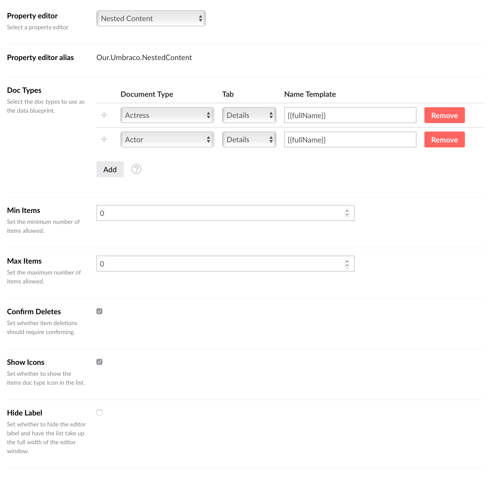
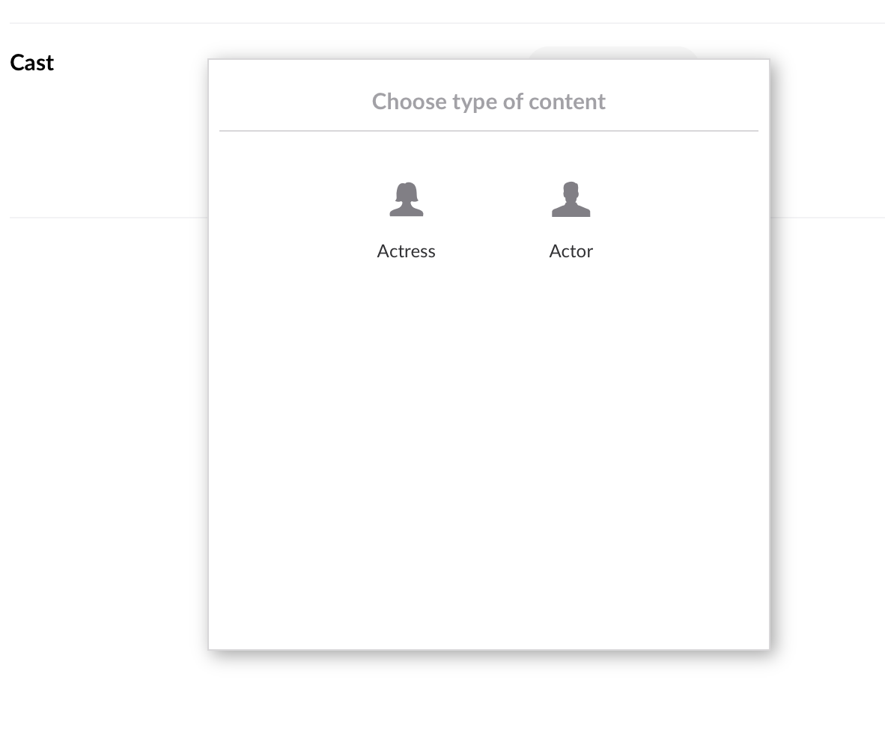
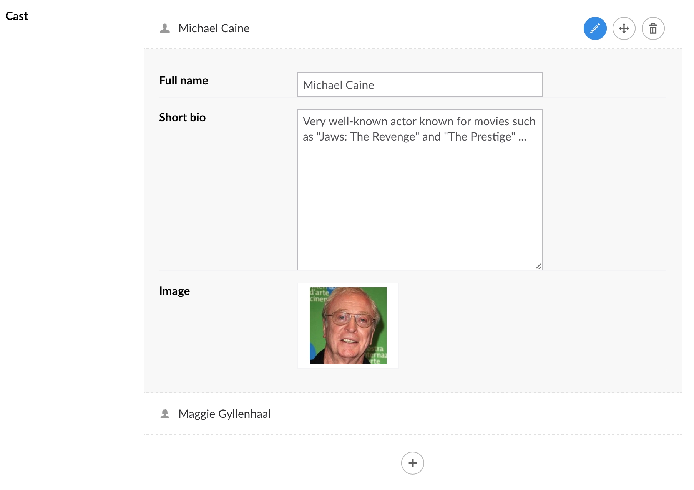
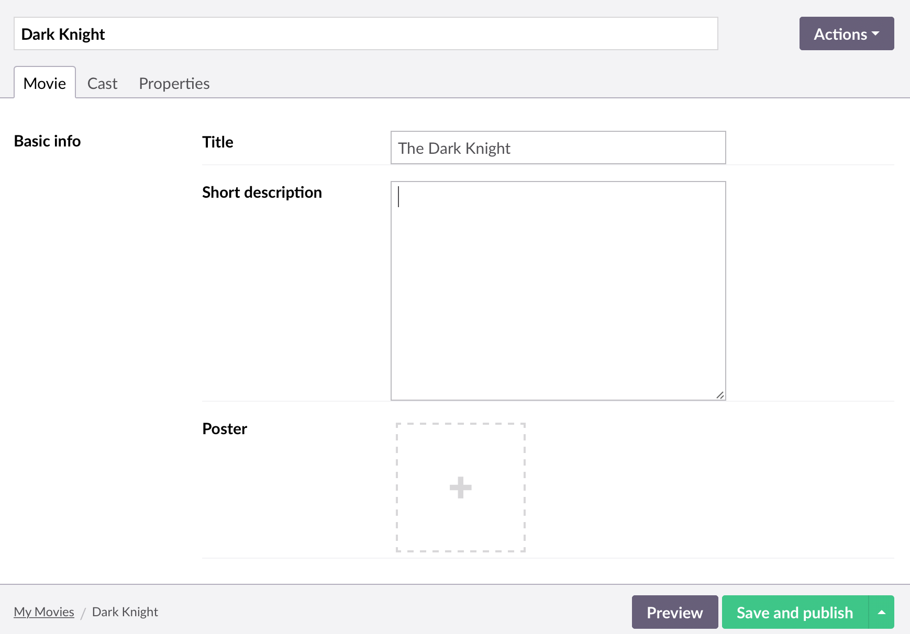

# Nested Content

`Alias: Umbraco.NestedContent`

`Returns: IEnumerable<IPublishedContent>` (or `IPublishedContent` depending on configuration)

**Nested Content** is a new list editing property editor for Umbraco 7.7, using Document Types to define the list item schema. By using document-types, you have the benefit of an easy/reusable UI that you are familiar with and get to re-use all the standard data-types as field editors.

## Configuring Nested Content

The **Nested Content** property editor is set-up/configured in the same way as any standard property editor, via the *Data Types* admin interface. To set-up your Nested Content property, create a new *Data Type* and select **Nested Content** from the list of available property editors.

You should then be presented with the **Nested Content** property editors data-type editor as shown below.

The data-type editor allows you to configure the following properties:

- **Doc Types** - Defines a list of document-types to use as data blue prints for this **Nested Content** instance. For each document-type you can provide the alias of the tab you wish to render (first tab is used by default if not set) as well as a template for generating list item labels using the syntax `{{propertyAlias}}`. 
    - If you would like to include the index position in the label, you can use `{{$index}}`. 
    - If your property links to a content, media or member node, you can use the Angular filter `{{ pickerAlias | ncNodeName }}` to show the node name rather than the node ID. 
    - If your property is a rich text editor, you can use the Angular filter `{{ pickerAlias | ncRichText }}` to show the unformatted text.
- **Min Items** - Sets the minimum number of items that should be allowed in the list. If greater than `0`, **Nested Content** will pre-populate your list with the minimum amount of allowed items and prevent deleting items below this level. Defaults to `0`.
- **Max Items** - Sets the maximum number of items that should be allowed in the list. If greater than `0`, **Nested Content** will prevent new items being added to the list above this threshold. Defaults to `0`.
- **Confirm Deletes** - Enabling this will require item deletions to require a confirmation before being deleted. Defaults to `true`.
- **Show Icons** - Enabling this will display the item's doc type icon next to the name in the **Nested Content** list.
- **Hide Label** - Enabling this will hide the property editor's label and expand the **Nested Content** property editor to the full width of the editor window.

Once your data type has been configured, simply set-up a property on your page doc type using your new data type and you are set to start editing.

## Editing Nested Content

When viewing a **Nested Content** editor for the first time, you'll be presented with a simple icon and help text to get you started.

Click the plus icon to start creating a new item in the list. 

If your **Nested Content** editor is configured with multiple document-types you will be presented with a dialog window to select which document-type you would like to use.

 

Simply click the icon of the document-type you wish to use and a new item will be created in the list using that document-type.

If you only have one document-type configured for your **Nested Content** editor, then clicking the plus icon will not display the dialog and instead will jump straight to inserting an entry in the editor for you ready to edit.

More items can be added to the list by clicking the plus icon for each additional item.

To close the editor for an item or open the editor for another item in the list, you click the edit icon.

To reorder the list, click and drag the move icon up and down to place the items in the order you want.

To delete an item simply click the delete icon. If the minimum number of items is reached, then the delete icon will appear greyed out to prevent going below the minimum allowed number of items.

### Single Item Mode

If **Nested Content** is configured with a minimum and maximum item of 1, then it goes into single item mode.

In single item mode, there is no icon displayed to add new items, and the single items editor will be open by default and its header bar removed.

In this mode, **Nested Content** works more like a fieldset than a list editor.

## Rendering Nested Content

To render the stored value of your **Nested Content** property, a built in value converter is provided for you. Just call the `GetPropertyValue<T>` method with a generic type of `IEnumerable<IPublishedContent>` and the stored value will be returned as a list of `IPublishedContent` entities.

Example:

    @inherits Umbraco.Web.Mvc.UmbracoViewPage
    @{
        var items = Model.GetPropertyValue<IEnumerable<IPublishedContent>>("myPropertyAlias");
    
        foreach(var item in items)
        {
            // Render your content, e.g. item.GetPropertyValue<string>("heading")
        }
    }

Each item is treated as a standard `IPublishedContent` entity, which means you can use all the property value converters you are used to using, as well as the built-in `@Umbraco.Field(...)` helper methods.

Example:

    @inherits Umbraco.Web.Mvc.UmbracoViewPage
    @{
        var items = Model.GetPropertyValue<IEnumerable<IPublishedContent>>("myPropertyAlias");
    
        foreach(var item in items)
        {
            <h3>@item.GetPropertyValue("heading")</h3>
            @Umbraco.Field(item, "bodyText")
        }
    }

#### Single Item Mode

If your **Nested Content** property editor is configured in single item mode, then the value converter will automatically know this and return a single `IPublishedContent` entity rather than an `IEnumerable<IPublishedContent>` list. Therefore, when using **Nested Content** in single item mode, you can simply call `GetPropertyValue<T>` with a generic type of `IPublishedContent` and you can start accessing the entity's properties straight away, rather than having to then fetch it from a list first.

Example:

    @inherits Umbraco.Web.Mvc.UmbracoViewPage
    @{
        var item = Model.GetPropertyValue<IPublishedContent>("myPropertyAlias");
    }
        <h3>@item.GetPropertyValue("heading")</h3>
        @Umbraco.Field(item, "bodyText")

