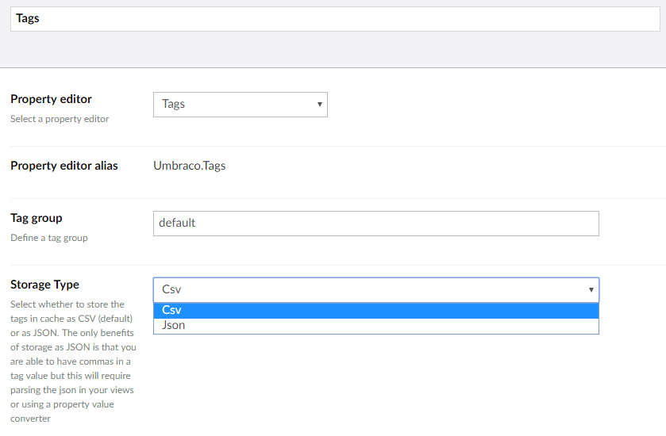

# Tags
`Alias: Umbraco.Tags`

`Returns: CSV` or `JSON`

The Tags property editor allows you to add multiple tags to a node.

## Data Type Definition Example

### Tag group

The **Tag group** setting provides a way to categorize your tags in groups. So for each category you will create a new instance of the Tags property editor and setup the unique category name for each instance. Whenever a tag is added to an instance of the tags property editor it's added to the tag group, which means it will appear in the Typeahead list when you start to add another tag. Only tags that belong to the specified group will be listed. So if you have a "Frontend" group and a "Backend" group the tags from the "Frontend" group will only be listed if you're adding a tag to the Tags property editor configured with the "Frontend" group name and vice versa.

### Storage type

Data can be saved in either CSV format or in JSON format. By default data is saved in CSV format. The difference between using CSV and JSON is that with JSON you can save a tag, which includes comma separated values and when saving using JSON you will need to either create a [property value converter](../../../../Extending/Property-Editors/value-converters.md "Read more about property value converters") or parse the JSON in the view. [The JSON code example](#typed-using-json) on the last part of this page will show how to parse the JSON in the view.

## Content Examples

### CSV tags

### JSON tags

### Tags typeahead

Whenever a tag has been added it will be visible in the typeahead when you start typing on other pages.

## MVC View Example - displays a list of tags

### Typed - Using CSV:
    @inherits Umbraco.Web.Mvc.UmbracoTemplatePage<ContentModels.Home>
    @using ContentModels = Umbraco.Web.PublishedContentModels;

    @{
	    var tags = Model.Content.Tags.ToString().Split(',');
    }

    @if(tags.Any()){
        <ul>
            @foreach(var tag in tags){
                <li>@tag</li>
            }
        </ul>
    }

### Typed - Using JSON:
Notice that Newtonsoft.Json is referenced in the below example. It's already a part of the Umbraco codebase and it's needed for doing the Desirializing of the JSON object so it's possible to loop over the tags later on.

    @inherits Umbraco.Web.Mvc.UmbracoTemplatePage<ContentModels.Home>
    @using ContentModels = Umbraco.Web.PublishedContentModels;
    @using Newtonsoft.Json;

    @{
	    var tags = JsonConvert.DeserializeObject<string[]>(Model.Content.Tags.ToString());
    }

    @if(tags.Any()){
        <ul>
            @foreach(var tag in tags){
                <li>@tag</li>
            }
        </ul>
    }
