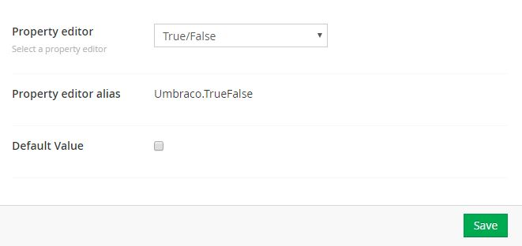

# True/False

`Returns: Boolean`

True/False is a simple checkbox which saves either 0 or 1, depending on the checkbox being checked or not.

## Data Type Definition Example

The True/False property has a setting which allows you to set the default value of the checkbox, either checked (true) or unchecked (false). This property was added in Umbraco 7.4.2.

## Content Example 

## MVC View Example - displays a list of links to child pages that are not hidden

### Typed:

	@{
		foreach (IPublishedContent page in Model.Content.Children){
            if (!page.GetPropertyValue<bool>("umbracoNaviHide"))
            {
				
@page.Name

			}
		}	
	}

### Dynamic (Obsolete):

The below example is using Dynamic access content access, which is considered obsolete and is not recommended to use. However the example is included for historical reasons if for instance a developer has overtaken a project where this approach is being used. This approach will be obsolete when Umbraco 8 is released and therefore is best to use the strongly typed example listed above.

	@{
		foreach (var page in CurrentPage.Children){
			if (!page.umbracoNaviHide){
				
@page.Name

			}
		}	
	}
