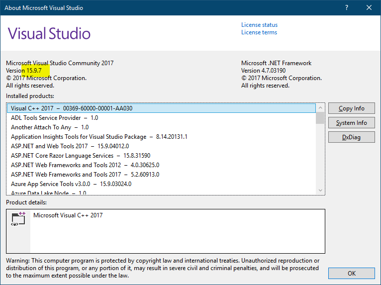
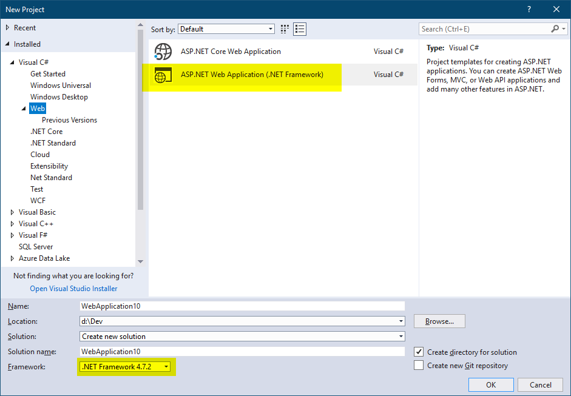
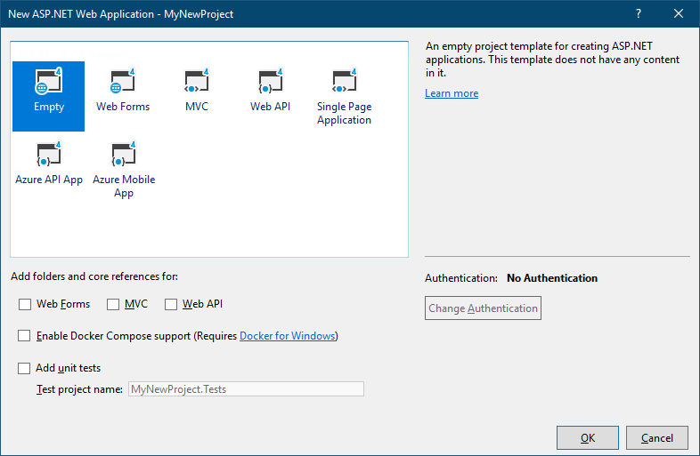
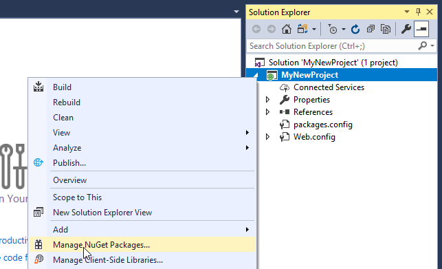
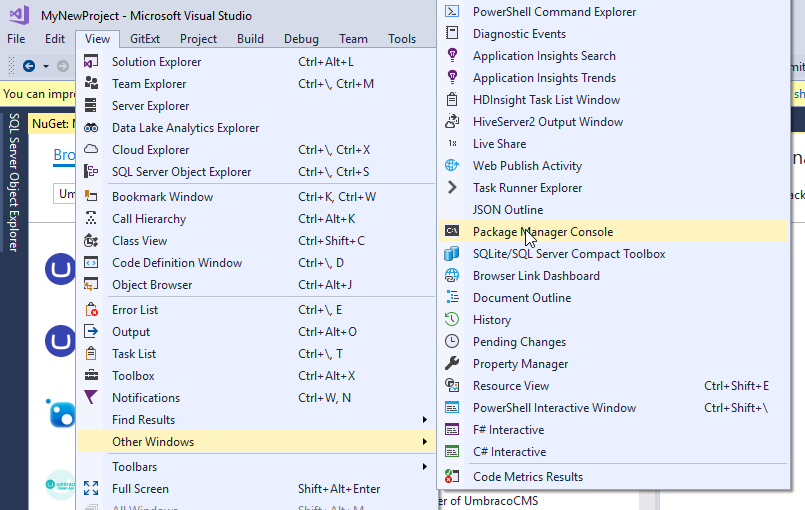

# Install Umbraco with NuGet

_Follow these steps to do a full install of Umbraco with NuGet._

## Abbreviated version
- You will get the best results if you install Umbraco in a **blank** C# web application Visual Studio project
- You will need Visual Studio 2017 updated to version **15.9.6 at least**
- Go to `File` > `New Project` > `ASP.NET Web application (.NET Framework)` using **.NET Framework 4.7.2** (important)
- In the next screen choose an **Empty** project template and don't enable any of the checkboxes, leave them all unselected
- Either use the NuGet Package explorer to install Umbraco 8 or the Package manager console (the command is: `Install-Package UmbracoCms`)
- Use CTRL+F5 to run the project and start the Umbraco installer

## New solution
To install Umbraco we first need a Visual Studio solution.

**Note:** Check that your Visual Studio version is at least 15.9.6 (`Help` > `About Microsoft Visual Studio`), lower versions do not install the correct NuGet dependencies.



### Visual Studio 2017
Go to **File > New Project** and pick an ASP.NET Web Application. 

**Note:** Double check that in the "Framework" dropdown you've selected `.NET Framework 4.7.2`, Umbraco will not work with lower versions than 4.7.2. Similarly, refrain from naming your solution `Umbraco`, as this will cause a namespace conflict with the CMS itself.



On the next step, select the **Empty** template. It's important to pick **empty** as other templates include incompatible versions of MVC and Json.NET. (Don't enable any of the checkboxes to add folders or core references. Umbraco will add them for you).  



## Finding and installing the Umbraco package
The latest release of Umbraco is always available in the NuGet gallery. All you have to do is search for it and install.

To install Umbraco from the Visual Studio interface, right-click on the new project you just made and choose **Manage NuGet Packages**.



You can then use the search function to find the package called `UmbracoCMS`. You'll also find the Umbraco CMS Core Binaries package and the Umbraco CMS Web package, they will be included automatically when you choose Umbraco CMS. So make sure to pick Umbraco CMS (highlighted in the image below) and click the **Install** icon (arrow down).


NuGet will then download dependencies and will install all of Umbraco's files in your new solution.

## Package manager console
You can do the exact same thing from the package manager console, which is a bit quicker as you don't have to click through the menus and search.

Enable the console by going to **Tools >  View > Other Windows >  Package Manager Console**.



Then simply type `Install-Package UmbracoCms` to start installing the latest version of Umbraco.


## Running the site
You can now run the site like you would normally in Visual Studio (using **F5** or the **Debug** button).

Follow the installation wizard and after a few easy steps and choices you should get a message saying the installation was a success.

## Post installation
You should note that the Umbraco NuGet package adds a build step to always include the Umbraco folders when you deploy using Web One-Click Publish with Visual Studio.  
You can see these folders in `packages/UmbracoCms x.y.z/build/UmbracoCms.targets`  
Should you need to exclude any of these folders or content, you can add a target to your `.pubxml` files in the `properties/Publish` folder. For instance if you need to exclude json data a plugin generates during production.

```xml
  <Target Name="StopUmbracoFromPublishingAppPlugins" AfterTargets="AddUmbracoFilesToOutput">
    <ItemGroup>
      <FilesForPackagingFromProject Remove=".\App_Plugins\UmbracoForms\Data\**\*.*"/>
    </ItemGroup>
  </Target>
```

[1]: https://youtrack.jetbrains.com/issue/RSRP-419513
