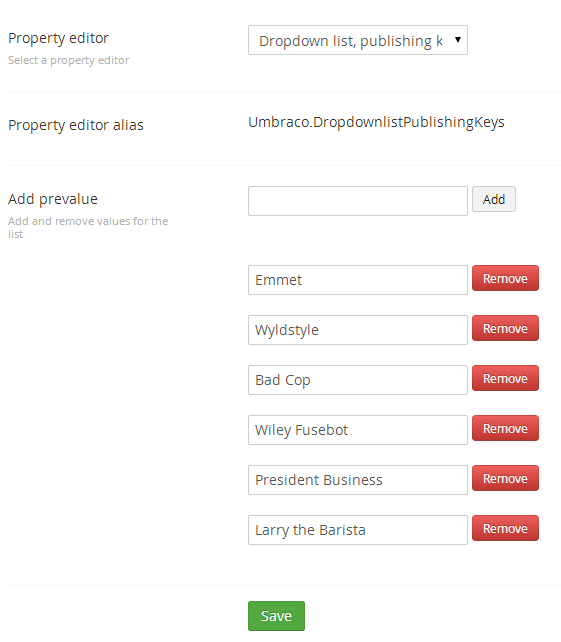

# (Obsolete) Dropdown List, Publishing Keys

`Returns: Int`

Displays a list of preset values. The value saved is the prevalue id.

## Settings

### Prevalues

You can add, edit & delete the data prevalues rendered within the dropdown list.

## Data Type Definition Example



## Content Example


## MVC View Example to output selected value

### Typed example

```csharp
@if (Model.Content.HasValue("character"))
{
    var preValue = Umbraco.GetPreValueAsString(Model.Content.GetPropertyValue<int>("character"));
    <p>@preValue</p>
}
```

### Dynamic example

:::warning
See [Common pitfalls](https://our.umbraco.com/documentation/reference/Common-Pitfalls/#dynamics) for more information about why the dynamic approach is obsolete.
:::

```csharp
@if (CurrentPage.HasValue("character"))
{
    var preValue = Umbraco.GetPreValueAsString(CurrentPage.character);
    <p>@preValue</p>
}
```

## MVC View Example list all nodes which have a certain item selected in the dropdown list

### Typed

```csharp
@{
    var valueToMatch = 31;
    // Get the first node inside the root
    var firstTypedContentAtRoot = Umbraco.TypedContentAtRoot().FirstOrDefault();
    if (firstTypedContentAtRoot != null)
    {
        var articles = firstTypedContentAtRoot.Children.Where(x => x.HasValue("character") && x.GetPropertyValue<int>("character") == valueToMatch);
        if (articles.Any())
        {
            <p>Pages with @valueToMatch selected:</p>
            <ul>
                @foreach (var page in articles)
                {
                    <li><a href="@page.Url">@page.Name</a></li>
                }
            </ul>
        }
    }
}
```

### Dynamic

:::warning
See [Common pitfalls](https://our.umbraco.com/documentation/reference/Common-Pitfalls/#dynamics) for more information about why the dynamic approach is obsolete.
:::

```csharp
@{
    var valueToMatch = 31;
    // Get the first node inside the root
    var firstContentAtRoot = Umbraco.ContentAtRoot().FirstOrDefault();
    if (firstContentAtRoot != null)
    {
        var articles = firstContentAtRoot.Children.Where("character == @0", valueToMatch);
        if (articles.Any())
        {
            <p>Pages with @valueToMatch selected:</p>
            <ul>
                @foreach (var page in articles)
                {
                    <li><a href="@page.Url">@page.Name</a></li>
                }
            </ul>
        }
    }
}
```
