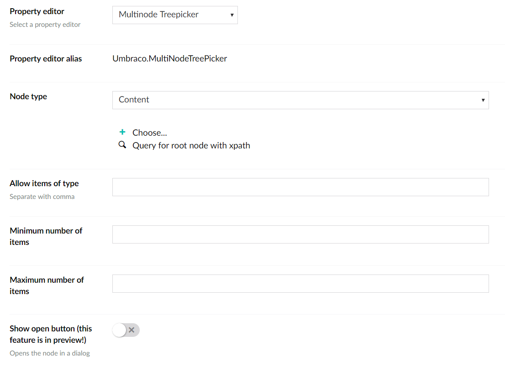

# Multinode Treepicker

`Alias: Umbraco.MultiNodeTreePicker`

`Returns: IEnumerable<IPublishedContent>`

## Settings

The Multinode Treepicker allows you to configure the type of tree to render and what part of the tree that should be rendered. For content it allows you to select a dynamic root node based on the current document using the multinode tree picker.

**Node type:** set the type of node, the root node of the tree, or query for the root node

For querying for a root node, you can use dynamic placeholders in the XPath query, following the below sample queries

    // get the first textpage below the current document
    $current/textpage: current page or closest found ancestor

    // get a descendant of type news article somewhere below the parent
    $parent//newsArticle: parent page or closest found ancestor

    // go to the root of the content tree
    $root

    // go the ancestor at @level=1 where your website root usually is.
    $site: Ancestor node at level 1

It is important to notice that all placeholders above act against published content only. So if you, therefore, try to fetch `$parent` of the current document, then Umbraco will return that or its closest published ancestor. So in case, the parent is not published, it will try the parent of that parent, and so on.


**Filter out items with type:** allow or disallow tree nodes with a certain content type alias.

Enter `typeAlias,altTypeAlias` to only allow selecting nodes with those alias'. Enter `!typeAlias,altTypeAlias` to only allow selecting nodes **not** with those alias'.

**Minimum/maximum number of items:** set a limit on the number of items allowed to be selected.


## Data Type Definition Example



## Content Example


## MVC View Example

### Typed

```csharp
@{
    var typedMultiNodeTreePicker = Model.Value<IEnumerable<IPublishedContent>>("featuredArticles");
    foreach (var item in typedMultiNodeTreePicker)
    {
        <p>@item.Name</p>
    }
}
```
