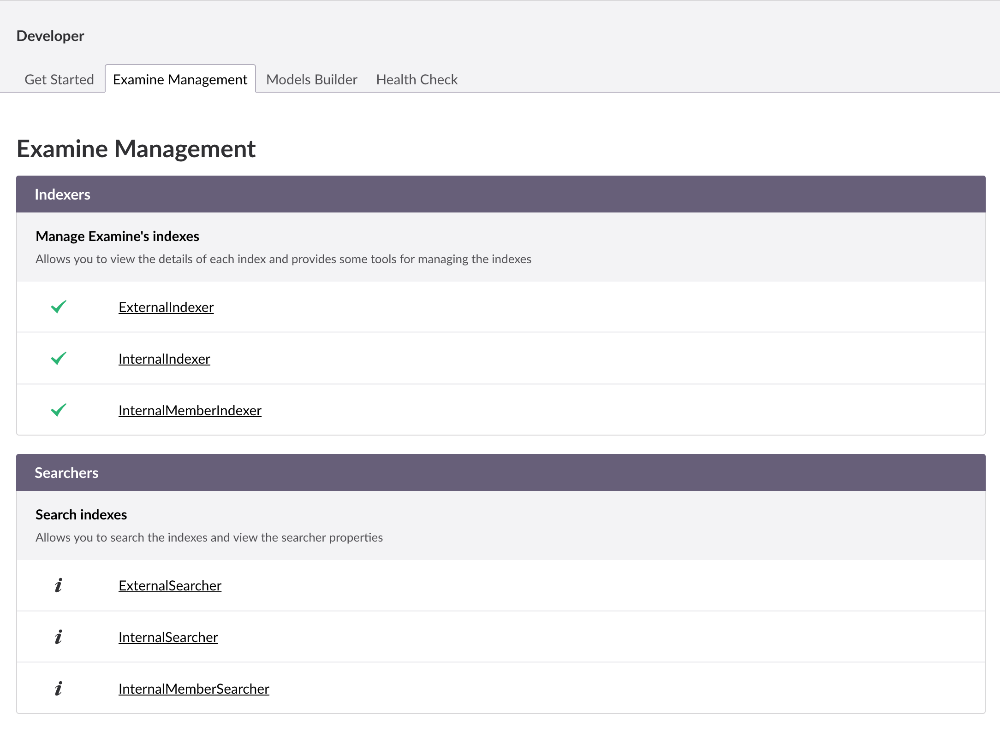
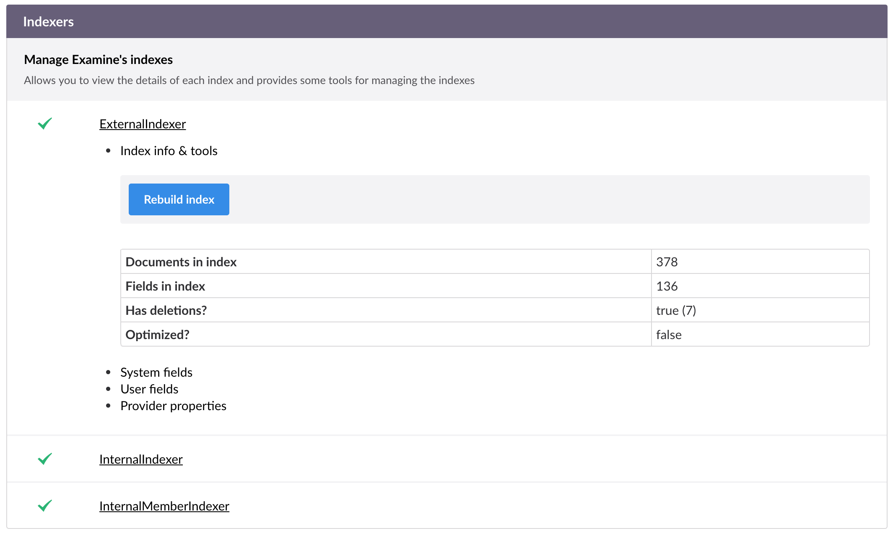
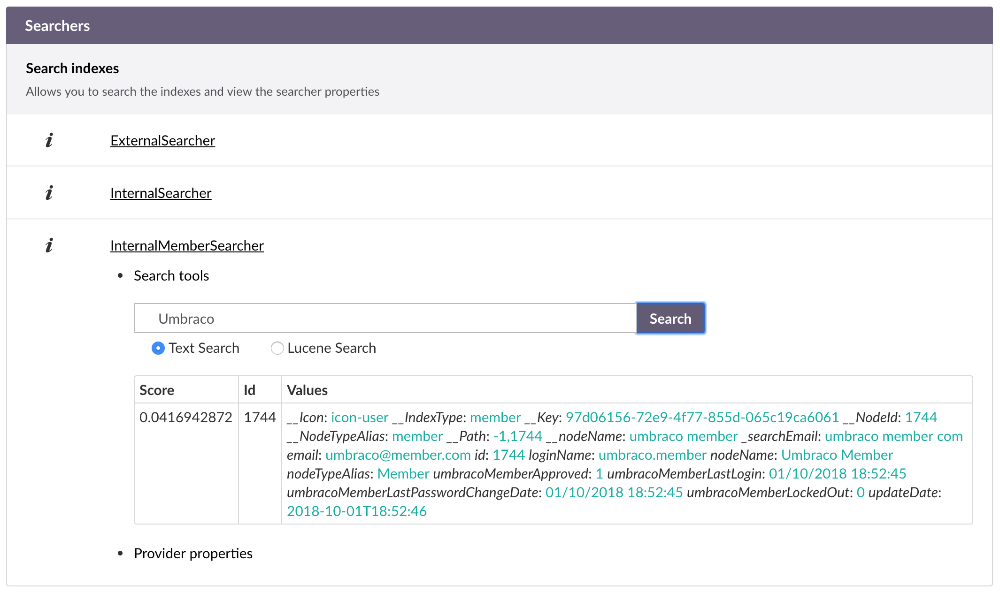

# Examine Management

_Provides an overview of the available Examine functionality available directly within the Umbraco backoffice_

:::note
This document has been verified for Umbraco 7.

If you are using Umbraco 8 or later versions, please refer to the note on the [Examine documentation landing page](index.md) for more details.
:::

## Overview

The Umbraco backoffice allows you to view details about your examine indexes and searches along with those that power the internal CMS search all in one place. You can see which fields are being indexed, rebuild the indexes if there's a problem and even test keywords to see what results would be returned.

The Examine Management section, accessible from within the Developer area, is split into two sections: Indexers and Searchers.

## Indexers

From the Indexers section, you can view details about each Examine index currently configured within your Umbraco installation. Selecting any of these will expand to show you four additional options, each discussed below.

### Index info & tools

This section allows you to see the high level statistics about the index that you selected, including how many documents and fields are currently being stored.

This section also provides the ability to rebuild the index should this be required. Depending on how much content your website has, rebuilding the search indexes could take a while and affect the site performance temporarily, so it is not recommended to do this while the website is under high load.

### System fields

From here you can see the default system fields that are stored for each document within the search index, including whether sorting is enabled for each field and what datatype the data is stored as.

### User fields

This section is exactly the same as system fields, but with any custom fields being listed instead.

### Provider properties

The final section within Indexers displays the details for the index provider. This can be useful to confirm the configuration that Umbraco is using and to ensure it is working as expected. This section also displays the full file path of the index itself.

## Searchers

The Searchers section is broken down into two sub-sections which provide configuration details along with the ability to test how a search index is currently performing.

### Search tools

The search tools allows you to enter a search term and receive results back from the searcher in question, to confirm it is working as expected. Search terms can be entered either as plain text or as a lucene query. Matching results are returned in their raw format, with the score, document ID and values being returned. The score is calculated by Examine depending on how closely the individual results matched the search term.

### Provider properties

The final section within Searchers displays the details for the searcher. This can be useful to confirm the configuration that Umbraco is using and to ensure it is working as expected. This section also displays the full file path of the index itself, along with the particular analyzer being used.
