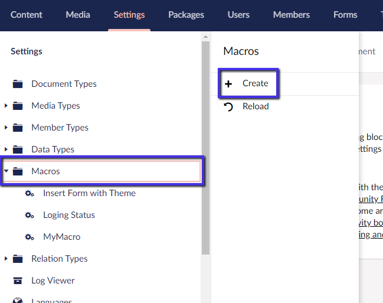
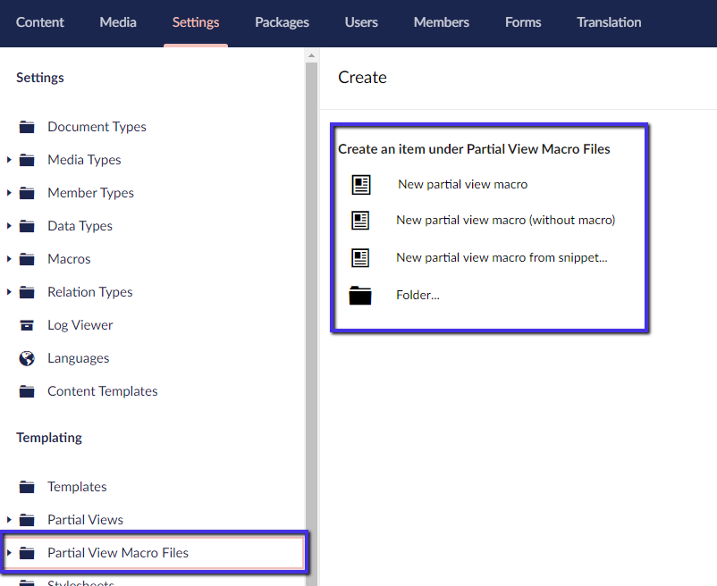
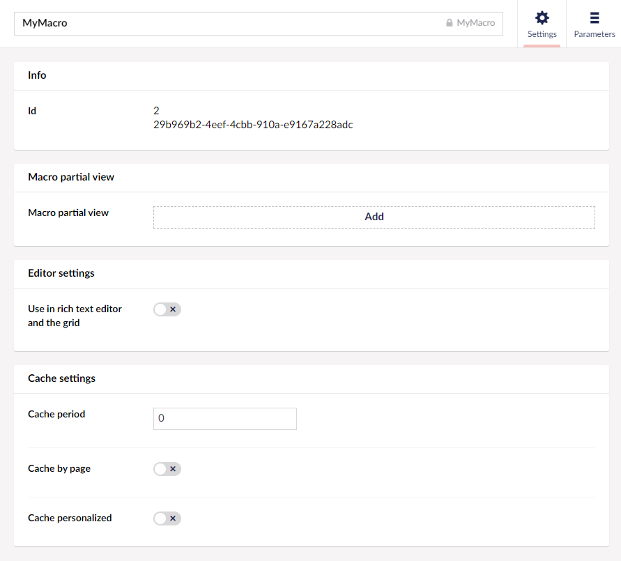

# Managing macros

In this article you can learn how to create and update a Macro, as well as how to configure its parameters.

## Creating macros

There are a couple of ways to create a macro.

### Manually

The first way is to manually create a macro, by right-clicking the Macro folder in the Settings section:

Give it a name in the dialog screen, and you'll be presented with the macro editor.

### Partial View Macro files

The second option is to create the macro through **Partial View Macro Files**.

The dialog provides the following options:

* New partial view macro: Will give you an empty macro with an associated empty partial view file
* New partial view macro (without macro): Will give you a partial view, without an associated macro
* New partial view macro from snippet...: Will give you the option to choose between a pre-defined set, including a macro and a partial view with a code snippet
* Folder...: Will give you the option to create a folder below "Partial View Macro Files"

## Macro Editor

The macro editor view comes with a set of configuration options.

### Macro partial view

Associate the macro with a partial view. This will already have been configured if you created the macro through the second option described above, where a Partial view was created along with the macro.

### Editor settings

> Use in rich text editor and the grid

If selected will allow an editor to insert this macro in to a Rich Text Editor and/or into a Grid editor.

## Caching options

> Cache period

Defines how many seconds the macro output will be cached for once it is rendered

> Cache by page

If selected, then the macro will be cached based on the current page it is rendered on. This is useful if your macro has content that is dynamic to the current page it is being rendered on. If your macro's output is static (the same) no matter what page it is rendered on then it is better to not check this box.

> Cache personalized

Similar to the 'Cache by page', this will cache the output of a macro based on a member that is logged in. If your macro is static (the same) no matter what member is logged in, or if your website does not have membership then it is better to not check this box.

## Macro parameters

Macro parameters can be used to change the output of a macro at runtime. Macro parameters are often used as a way for your editors to change the output of a macro when they insert them into rich text editors. As an example, suppose you have a widget that displays a list of links which are children of a particular content item. You could define a macro parameter that indicates for which content item to render child links for and your editor can select this content item when inserting the macro into the rich text editor.

The macro parameter dialog looks like this:

Here you can add/modify/remove macro parameters.

### Default macro parameter types

This list defines the different types of macro parameters:

- Checkbox(`Umbraco.TrueFalse`) - A true/false value
- Content Type picker (`contentType`) - Choose a type from existing Document Types
- Decimal (`Umbraco.Decimal`) - accepts only numbers
- Email address (`Umbraco.EmailAddress`) - validates to valid email adresses
- Multiple Content Picker (`Umbraco.MultiNodeTreePicker`) - pick 1 or more nodes from the Content tree
- Multiple Content Type Picker (`contentTypeMultiple`) - pick 1 or more types from existing Document Types
- Multiple Media Picker (`Umbraco.MultipleMediaPicker`) - pick 1 or more media items
- Multiple Property Type Picker (`propertyTypePickerMultiple`) - pick 1 or more from existing property types
- Multiple Tab Picker (`tabPickerMultiple`) - pick 1 or more from existing tabs
- Numeric (`Umbraco.Integer`) - accepts only numbers
- Property Type Picker (`propertyTypePicker`) - choose property from existing property types
- Tab picker (`tabPicker`) - select 1 from list of existing tabs
- Textarea (`Umbraco.TextArea`) - multiple lines of text
- Textbox (`Umbraco.TextBox`) - single line of text
- Media picker (`Umbraco.MediaPicker`) - select a single media item
- Content Picker (`Umbraco.ContentPicker`) - select a single content node from the Content tree
- Form Picker (`UmbracoForms.FormsPicker`) - choose from exising Umbraco Forms
- Forms Theme Picker (`UmbracoForms.ThemePicker`) - choose from existing Forms Themes