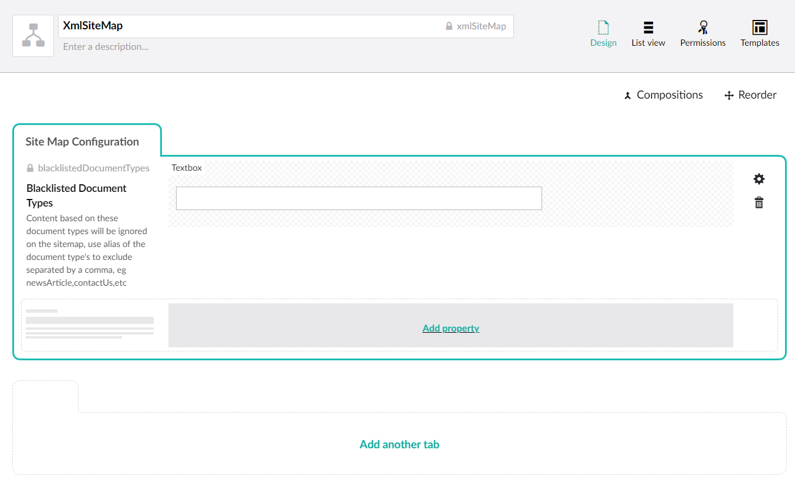
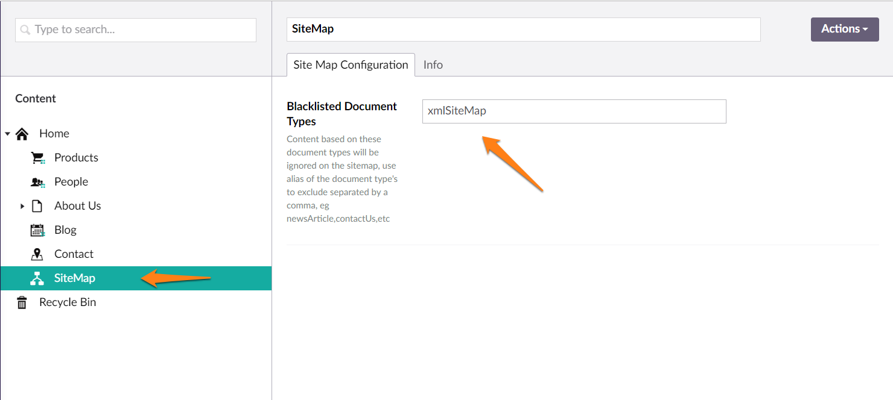
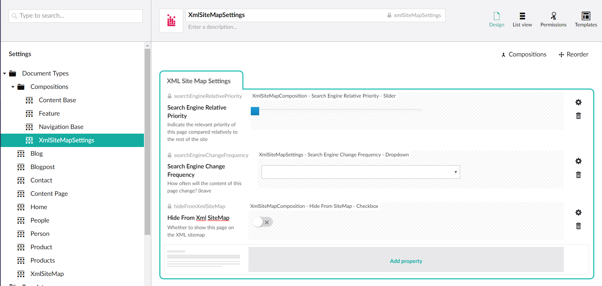
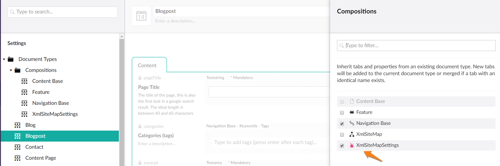

# Tutorial - Creating a Search Engine XML Site Map

## Overview

Adding an XML sitemap to your site makes it easier for search engine's such as Google to find and index your site pages. Your friendly SEO consultancy will recommend you have a google site map for 'better SEO'.

There isn't an 'out of the box' XML sitemap generator with Umbraco, this tutorial will show you how to create one - but if you are in a hurry, there are some Umbraco Packages that will quickly do the job for you:

- [Cultiv Search Engine Sitemap](https://our.umbraco.com/packages/website-utilities/cultiv-search-engine-sitemap/)
- [Marcel Digital Umbraco XML Sitemap](https://github.com/marceldigital/Umbraco-XML-Sitemap)

### What does an XML SiteMap look like?

Essentially this is just a list of urls for the content on your site:

See [Sitemaps XML format](https://www.sitemaps.org/protocol.html) for the XML schema the sitemap needs to conform to:

```xml
<?xml version="1.0" encoding="UTF-8"?>
<urlset xmlns="http://www.sitemaps.org/schemas/sitemap/0.9">
    <url>
        <loc>https://www.example.com/</loc>
        <lastmod>2005-01-01</lastmod>
        <changefreq>monthly</changefreq>
        <priority>0.8</priority>
    </url>
</urlset>
```

The XML Sitemap is a guide for search engines to discover and index your content, it doesn't need to be exhaustive, each page on your site that you wish to feature will be represented by a `<url>` entry in the list.

### Approach

There are many ways of approaching this task, the best approach will be determined by the size of your site, and your preference for implementing functionality in Umbraco, for simplicity sake we're going to write this code directly in a template using Razor and IPublishedContent, but you may want to use route hijacking to write the code in an MVC controller or XSLT is still a really good fit for this kind of task.

1. We'll create a new Document Type called 'XmlSiteMap' with corresponding 'XmlSiteMap' template (visiting this page will trigger the rendering of the XML Sitemap).
    - The XmlSiteMap document type will contain a 'Blacklisted Document Types' property to the XmlSiteMap Document Type to list types of content we wish to exclude from the Site Map (or you could probably take a 'whitelist' approach if it is easier to specify types that should be included rather than define those that will be excluded.)
2. We'll create a 'SiteMap' Composition, containing a consistent set of 'Site Map related properties, and we'll add this to all of the different document types of the site.
    - The 'SiteMap' Composition will contain a 'hide from Xml Site Map' checkbox, to give editors the ability to hide a certain page from the XML Sitemap.
3. The implementation will start at the homepage of the site and loop through all the children, iterating in turn through the children of the children, etc, checking at each level whether to continue further based on the properties of the page.

## 1. Create the XmlSiteMap Document Type



The act of creating the document type, unless you specify otherwise will also create a corresponding template called 'XmlSiteMap'.

Visit your homepage document type, and choose 'Permissions', allow the new XmlSiteMap document type to be created underneath the homepage.

Create your XmlSiteMap page in your content tree.



and add the xmlSiteMap document type to your 'Blacklist'.

## 2. Create XmlSiteMapSettings Composition

A site map entry will allow you to state the relative priority of any particular page in terms of its importance within your site, where a value of 1.0 is super very important, and 0.1 close to insignificant, you can also state 'how often' the content will change on a particular page, eg weekly, monthly etc, and this will help the search engine know when to return to reindex any regularly updated content.

Create the XmlSiteMapSettings composition (Document Type Without Template) with name: __XmlSiteMapSettings__

- __Search Engine Relative Priority__ - Slider - MinValue: 0.1, MaxValue: 1, Step Increments 0.1, InitialValue 0.5
    (Relative priority of this page between 0.1 and 1.0, where 1.0 is the most important page on the site and 0.1 isn't)
- __Search Engine Change Frequency__ - Dropdown - always, hourly, daily, weekly, monthly, yearly, never 
(How often the content of this page changes, for google site map, if left blank will inherit the setting for the section)
- __Hide From Xml Sitemap__ (hideFromXmlSitemap) - checkbox.

At this point your composition should look similar to this:


:::tip
(Using pink for composition icons make them easier to spot in the list when you are curating your document types)
:::

Add this composition to all of the document types on your site!


Now editors have the ability to set these values for each page of the site, but again, rather than expect them to set them on every single page, when we check the values of these properties, if they are blank, we'll use the values from the parent or parent's parent nodes, using 'recursion' up the Umbraco Content Tree, enabling the values to be set in one place for a particular section, eg. setting once on a News Section, would then apply to all News Articles.

### 3. Building the XmlSiteMap.cshtml template

We'll start by writing out in the template the xml schema for the sitemap and because we don't want our template to inherit any 'master' html layout we'll set the 'layout' to be null.

```csharp
@inherits Umbraco.Web.Mvc.UmbracoTemplatePage
@{Layout = null; Response.ContentType = "text/xml"; }<urlset xmlns="http://www.sitemaps.org/schemas/sitemap/0.9" xmlns:xsi="http://www.w3.org/2001/XMLSchema-instance" xsi:schemalocation="http://www.google.com/schemas/sitemap/0.9 http://www.sitemaps.org/schemas/sitemap/0.9/sitemap.xsd" xmlns:image="http://www.google.com/schemas/sitemap-image/1.1">[INSERT SITE MAP CONTENT HERE]</urlset>
```

Notice how we're not adding any spaces or carriage returns before the `<urlset>` opening declaration, even though it would be easier to read if we did, we want to avoid making the XML invalid.

### Getting a reference to the sitemap starting point

We're going to start at the site homepage, and since our XmlSiteMap page is created underneath this page, we can use the 'Site()' helper to find the starting point for the sitemap as IPublishedContent.

`IPublishedContent siteHomePage = Model.Content.Site();`

### Rendering a site map entry

We will retrieve each page in the site as **IPublishedContent**, and read in the SearchEngineChangeFrequency(recursively), SearchEngineRelativePriority, Url, when it was last modified etc...

This is a great candidate for a [Razor Helper](https://weblogs.asp.net/scottgu/asp-net-mvc-3-and-the-helper-syntax-within-razor) - these helpers are a great way to organise your razor view implementation, to stop yourself repeating code and html in multiple places - here we'll have one place to write out the logic for our Url entry:

```csharp
@helper RenderSiteMapUrlEntry(IPublishedContent node)
{
    //we're passing 'true' as an additional parameter to HasValue and GetPropertyValue this means the value will be sought 'recursively' up the content tree, until a value is found.
    var changeFreq = node.HasValue("searchEngineChangeFrequency", true) ? node.GetPropertyValue<string>("searchEngineChangeFrequency", true) : "monthly";
    //with the relative priority, this is a per page setting only, so we're not using recursion, so we won't pass 'true' here and we'll default to 0.5 if no value is set
    var priority = node.HasValue("searchEngineRelativePriority") ? node.GetPropertyValue<string>("searchEngineRelativePriority") : "0.5";
    <url>
        <loc>@EnsureUrlStartsWithDomain(node.UrlWithDomain())</loc>
        <lastmod>@(string.Format("{0:s}+00:00", node.UpdateDate))</lastmod>
        <changefreq>@changeFreq</changefreq>
        <priority>@priority</priority>
    </url>
}
```

:::note
We're using __IPublishedContent__ in this example but if you prefer to use __ModelsBuilder__ you could take advantage of the fact that the Xml Sitemap Settings composition will create an interface called __IXmlSiteMapSettings__ - allowing you to adjust the helper to accept this 'type' eg _RenderSiteMapUrlEntry(IXmlSiteMapSettings node)_ and allowing you to read the properties without the __GetPropertyValue__ helper, eg _node.SearchEngineRelativePriority_ - however you would need to create an extension method on __IXmlSiteMapSettings__ to implement the recursive functionality we make use of on the __SearchEngineChangeFrequency__ property.
:::

#### EnsureUrlStartsWithDomain - Razor Function

[Razor Functions](https://blogs.msdn.microsoft.com/timlee/2010/07/30/using-functions-in-an-asp-net-page-with-razor-syntax/) are similar to Razor Helpers, but instead of writing out html, they can return a value, again enabling you to write key functionality in a single place in your views - [you can also share functions across multiple razor views!](https://farm-fresh-code.blogspot.com/2011/05/sharing-razor-functions-across-views.html)  - We'll create a Razor Function to ensure the urls we display on our sitemap have the correct domain (you aren't meant to have relative urls on an Xml Sitemap - citation needed),

Razor functions exist inside a __single__ @functions block inside your template

```csharp
@functions {
    private static string EnsureUrlStartsWithDomain(string url)
    {
        if (url.StartsWith("http")){
            return url;
        }
        else {
            //whatever makes sense for your site here...
            var domainPrefix = string.Format("https://{0}/", HttpContext.Current.Request.ServerVariables["HTTP_HOST"]);
            return domainPrefix + url;
        }
    }
}
```

#### Xml Sitemap for the homepage

So for the homepage we'll now have:

```csharp
@inherits Umbraco.Web.Mvc.UmbracoTemplatePage
@{Layout = null; Response.ContentType = "text/xml";IPublishedContent siteHomePage = Model.Content.Site(); }<urlset xmlns="http://www.sitemaps.org/schemas/sitemap/0.9" xmlns:xsi="http://www.w3.org/2001/XMLSchema-instance" xsi:schemalocation="http://www.google.com/schemas/sitemap/0.9 http://www.sitemaps.org/schemas/sitemap/0.9/sitemap.xsd" xmlns:image="http://www.google.com/schemas/sitemap-image/1.1">@RenderSiteMapUrlEntry(siteHomePage)</urlset>
```

visit the url of your sitemap page (http://yoursite.com/sitemap) and this will render a single sitemap entry for the homepage, which ermmmm, isn't very comprehensive!


#### Looping through the rest of the site

So now we need to find the pages created beneath the homepage, and see if they should be added to the sitemap, and then in turn look at the pages beneath those etc, until the entire content tree is traversed.

We can use __IPublishedContent__'s _.Children_ method to return all the pages directly beneath a particular page eg:

    IEnumerable<IPublishedContent> sitePages = siteHomePage.Children();

So we need to loop through each of these 'child' pages, and write out their sitemap markup using our helper, and then in turn loop through their children (grandchildren?)  etc and so on... (great-great-grandchildren...)

```csharp
foreach (var page in sitePages){
    @RenderSiteMapUrlEntry(page)
    if (page.Children.Any()){
        var childPages = page.Children();
        foreach (var childPage in childPages){
            @RenderSiteMapUrlEntry(childPage)
            if (childPage.Children.Any()){
                var grandChildPages = childPage.Children();
                foreach (var grandChildPage in grandChildPages){
                    //... on forever how do we stop?
                }
            }
        }
    }
}
```

So hopefully you can see the problem here, how deep do we go? How do we handle the repetition forever...

... well we can use recursion - we can create a further razor helper that 'calls itself' [insert inception reference here]...

#### Recursive Helper

If we create a helper called perhaps 'RenderSiteMapUrlEntriesForChildren' that then accepts a 'Parent Page' parameter as the starting point, then we can find the children of this Parent Page, write out their Site Map Entry, and then... call this same method again... from itself - recursion!

```csharp
@helper RenderSiteMapUrlEntriesForChildren(IPublishedContent parentPage)
{
    foreach (var page in parentPage.Children)
    {
        @RenderSiteMapUrlEntry(page)
        if (page.Children.Any()){
            @RenderSiteMapUrlEntriesForChildren(page)
        }
    }
}
```

Let's update our template to call this recursive helper:

```csharp
@inherits Umbraco.Web.Mvc.UmbracoTemplatePage
@{Layout = null; Response.ContentType = "text/xml";IPublishedContent siteHomePage = Model.Content.Site(); }<urlset xmlns="http://www.sitemaps.org/schemas/sitemap/0.9" xmlns:xsi="http://www.w3.org/2001/XMLSchema-instance" xsi:schemalocation="http://www.google.com/schemas/sitemap/0.9 http://www.sitemaps.org/schemas/sitemap/0.9/sitemap.xsd" xmlns:image="http://www.google.com/schemas/sitemap-image/1.1">@RenderSiteMapUrlEntry(siteHomePage)@RenderSiteMapUrlEntriesForChildren(siteHomePage)</urlset>
```

and we should have a full XML sitemap rendered for the site!


#### Checking if a page should be on the sitemap

This is all very well, but what if some super secret pages shouldn't be on the sitemap? and what about the document type blacklist we mentioned earlier? and what if we only want to go 3 levels deep?

##### HideFromSiteMap

We added a hideFromXmlSitemap checkbox to all of our document types via our XmlSiteMapSettings composition, let's update the helper to only return children that haven't got the checkbox set, excluding these pages (and any beneath them) from the sitemap.

```csharp
@helper RenderSiteMapUrlEntriesForChildren(IPublishedContent parentPage)
{
    foreach (var page in parentPage.Children.Where(f=>!f.GetPropertyValue<bool>("hideFromXmlSiteMap")))
    {
        @RenderSiteMapUrlEntry(page)
        if (page.Children.Any(f=>!f.GetPropertyValue<bool>("hideFromXmlSiteMap"))){
            @RenderSiteMapUrlEntriesForChildren(page)
        }
    }
}
```

Now revisit a page in the content tree, and tick the Hide from SiteMap option, if all has gone well, it will disappear from the XmlSitemap page!

##### Depth

What if we only want to restrict 'how deep' the sitemap should go?

If we add to our XmlSiteMap document type a new property of numeric type called 'maxSiteMapDepth'... we can use that value to determine when to stop iterating:

```csharp
@inherits Umbraco.Web.Mvc.UmbracoTemplatePage
@{Layout = null; Response.ContentType = "text/xml"; int maxSiteMapDepth = Model.Content.HasValue("maxSiteMapDepth") ? Model.Content.GetPropertyValue<int>("maxSiteMapDepth") : int.MaxValue; IPublishedContent siteHomePage = Model.Content.Site(); }<urlset xmlns="http://www.sitemaps.org/schemas/sitemap/0.9" xmlns:xsi="http://www.w3.org/2001/XMLSchema-instance" xsi:schemalocation="http://www.google.com/schemas/sitemap/0.9 http://www.sitemaps.org/schemas/sitemap/0.9/sitemap.xsd" xmlns:image="http://www.google.com/schemas/sitemap-image/1.1">@RenderSiteMapUrlEntry(siteHomePage)@RenderSiteMapUrlEntriesForChildren(siteHomePage, maxSiteMapDepth)</urlset>

.....

@helper RenderSiteMapUrlEntriesForChildren(IPublishedContent parentPage, int maxSiteMapDepth)
{
    foreach (var page in parentPage.Children.Where(f=>!f.GetPropertyValue<bool>("hideFromXmlSiteMap")))
    {
        @RenderSiteMapUrlEntry(page)
        if (page.Level < maxSiteMapDepth && page.Children.Any(f=>!f.GetPropertyValue<bool>("hideFromXmlSiteMap"))){
            @RenderSiteMapUrlEntriesForChildren(page, maxSiteMapDepth)
        }
    }
}
```

Set your MaxSiteMap depth to be 2 on your XmlSiteMap content item, and save and republish, your sitemap will now only contain entries for the top two levels, leaving the value blank, will mean no Maximum Depth restriction will be applied.

##### DocumentType Blacklist

Our Xml Sitemap includes an entry for itself on the XML Sitemap, I thought we had excluded that document type, when we created the documentTypeBlacklist property...

... we did but we haven't checked this value in the helper yet.

```csharp
string blacklistedDocumentTypeList = Model.Content.GetPropertyValue<string>("blacklistedDocumentTypes");
string[] blackListedDocumentTypes = (!String.IsNullOrEmpty(blacklistedDocumentTypeList)) ? blacklistedDocumentTypeList.Split(new char[] { ',' }, StringSplitOptions.RemoveEmptyEntries) : new string[] { };
```

now we can pass this value into our helper

```csharp
@helper RenderSiteMapUrlEntriesForChildren(IPublishedContent parentPage, int maxSiteMapDepth, string[] documentTypeBlacklist)
{
    foreach (var page in parentPage.Children.Where(f => !documentTypeBlacklist.Contains(f.DocumentTypeAlias) && !f.GetPropertyValue<bool>("hideFromXmlSiteMap")))
    {
        @RenderSiteMapUrlEntry(page)
        if (page.Level < maxSiteMapDepth && page.Children.Any(f => !documentTypeBlacklist.Contains(f.DocumentTypeAlias) && !f.GetPropertyValue<bool>("hideFromXmlSiteMap")))
        {
            @RenderSiteMapUrlEntriesForChildren(page, maxSiteMapDepth, documentTypeBlacklist)
        }
    }
}
```

### The finished sitemap template

```csharp
@inherits Umbraco.Web.Mvc.UmbracoTemplatePage
@{Layout = null;
    Response.ContentType = "text/xml";
    string blacklistedDocumentTypeList = Model.Content.GetPropertyValue<string>("blacklistedDocumentTypes");
    string[] blackListedDocumentTypes = (!String.IsNullOrEmpty(blacklistedDocumentTypeList)) ? blacklistedDocumentTypeList.Split(new char[] { ',' }, StringSplitOptions.RemoveEmptyEntries) : new string[] { };
    int maxSiteMapDepth = Model.Content.HasValue("maxSiteMapDepth") ? Model.Content.GetPropertyValue<int>("maxSiteMapDepth") : int.MaxValue;
    IPublishedContent siteHomePage = Model.Content.Site();
}<urlset xmlns="http://www.sitemaps.org/schemas/sitemap/0.9" xmlns:xsi="http://www.w3.org/2001/XMLSchema-instance" xsi:schemalocation="http://www.google.com/schemas/sitemap/0.9 http://www.sitemaps.org/schemas/sitemap/0.9/sitemap.xsd" xmlns:image="http://www.google.com/schemas/sitemap-image/1.1">@RenderSiteMapUrlEntry(siteHomePage)@RenderSiteMapUrlEntriesForChildren(siteHomePage, maxSiteMapDepth, blackListedDocumentTypes)</urlset>

@helper RenderSiteMapUrlEntry(IPublishedContent node)
{
    //we're passing 'true' as an additional parameter to GetPropertyValue to read the value from the parent nodes, so this setting could be set 'per section
    var changeFreq = node.GetPropertyValue<string>("searchEngineChangeFrequency", true);
    if (String.IsNullOrEmpty(changeFreq))
    {
        changeFreq = "monthly";
    }
    //with the relative priority, this is a per page setting, so we're not passing true
    var priority = node.GetPropertyValue<string>("searchEngineRelativePriority");
    if (String.IsNullOrEmpty(priority))
    {
        priority = "0.5";
    }
    <url>
        <loc>@EnsureUrlStartsWithDomain(node.UrlWithDomain())</loc>
        <lastmod>@(string.Format("{0:s}+00:00", node.UpdateDate))</lastmod>
        <changefreq>@changeFreq</changefreq>
        <priority>@priority</priority>
    </url>
}

@helper RenderSiteMapUrlEntriesForChildren(IPublishedContent parentPage, int maxSiteMapDepth, string[] documentTypeBlacklist)
{
    foreach (var page in parentPage.Children.Where(f => !documentTypeBlacklist.Contains(f.DocumentTypeAlias) && !f.GetPropertyValue<bool>("hideFromXmlSiteMap")))
    {
        @RenderSiteMapUrlEntry(page)
        if (page.Level < maxSiteMapDepth && page.Children.Any(f => !documentTypeBlacklist.Contains(f.DocumentTypeAlias) && !f.GetPropertyValue<bool>("hideFromXmlSiteMap")))
        {
            @RenderSiteMapUrlEntriesForChildren(page, maxSiteMapDepth, documentTypeBlacklist)
        }
    }
}

@functions {
    private static string EnsureUrlStartsWithDomain(string url)
    {
        if (url.StartsWith("http"))
        {
            return url;
        }
        else
        {
            //whatever makes sense for your site here...
            var domainPrefix = string.Format("https://{0}/", HttpContext.Current.Request.ServerVariables["HTTP_HOST"]);
            return domainPrefix + url;
        }
    }
}
```

#### Add sitemap to robots.txt

Finally let search engines know the url for your sitemap by updating your robots.txt file accordingly:

    Sitemap: https://www.yourlovelysite.com/xmlsitemap
    User-agent: *

Once you introduce a Sitemap for the first time, you might suddenly find yourself being crawled by multiple different search engine bots, which is exactly what you want, however if your site or hosting is a littly creaky, you might want to add a crawl rate to the robots.txt to instruct well behaved search engine bots to give a bit of breathing space to your site in between crawl requests:

    Sitemap: https://www.yourlovelysite.com/xmlsitemap
    User-agent: *
    Crawl-delay: 10

#### Test your Xml SiteMap in a validation tool

Visit [Xml-Sitemaps.com](https://www.xml-sitemaps.com/validate-xml-sitemap.html) to test the validity of your generated Xml Site Map.

#### Summary

This is just one way to add an XML Sitemap to your site, depending on your site it might not always be the 'best way' eg it will be much faster using XSLT! - particulary for large sites - however this tutorial aims to serve as an introduction to Razor, Helpers, Functions, IPublishedContent, and working with the Umbraco Content Tree, it is not trying to establish the 'only best practice' way to achieve an Xml SiteMap!
