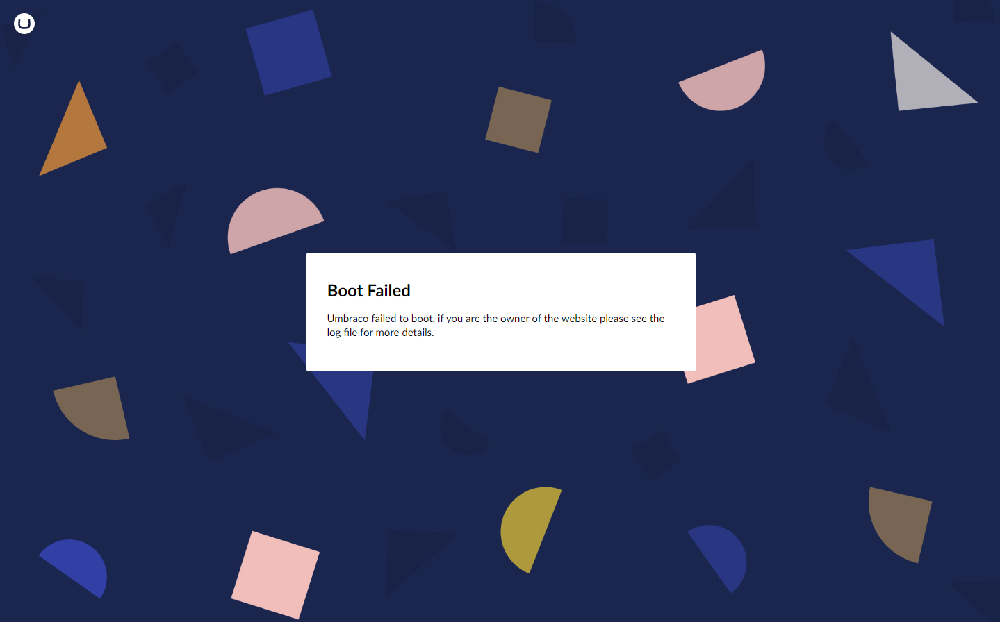

# Implementing custom error pages

Umbraco is built upon Microsoft's .NET Framework and is using ASP.NET. This provides a number of options when setting up custom error pages on your website.

Custom error handling might make your site look more on-brand and minimize the impact of errors on user experience. An example, a custom 404 with some helpful links (or a search function) could bring some value to the site.

## Contents

This article contains guides on how to create custom error pages for the following types of errors:

- [404 errors ("Page not found")](#404-errors)

## In-code error page handling

One way is to watch for error events and serve corresponding pages via C# code. Please refer to the [Custom 404 handlers](../../Reference/Config/404handlers/) article for an example.

## 404 errors

In this method we will use a 404 page created via the backoffice.

### Create a 404 page in the backoffice

First, create a new Document Type (though you could also use a more generic Document Type if you already have one) called Page404.
Make sure the permissions are set to create it under Content.
Properties on this Document Type are optional - in most cases, the 404 not found page would be static.
Make sure to assign (and fill out) the template for your error page, and then create it in Content.

### Set a custom 404 page in appsettings.json

Once all of that is done, grab your published error page's ID, GUID or path and head on over to the `appsettings.json`.

The value for error pages can be:

- A content item's GUID ID (example: 26C1D84F-C900-4D53-B167-E25CC489DAC8)
- An XPath statement (example: //errorPages[@nodeName='My cool error']
- A content item's integer ID (example: 1234)

That is where the value you grabbed earlier comes in. Fill it out like so:

```json
{
    "Umbraco": {
        "CMS": {
            "Content": {
                "Error404Collection": [
                    {
                        "Culture": "default",
                        "ContentKey": "81dbb860-a2e3-49df-9a1c-2e04a8012c03"
                    }
                ]
            }
        }
    }
}
```

The above sample uses a GUID value.

:::note
With this approach, you can set different 404 pages for different languages (cultures) - such as `en-us`, `it` etc.
:::

:::warning
If you are hosting your site on Umbraco Cloud, the best approach would be using an XPath statement. This is because content IDs might differ across Cloud environments.
:::

XPath example:

```json
{
    "Umbraco": {
        "CMS": {
            "Content": {
                "Error404Collection": [
                    {
                        "Culture": "default",
                        "ContentXPath": "//errorPages[@nodeName='My cool error']"
                    }
                ]
            }
        }
    }
}
```

:::note
In the above XPath example `//errorPages` is the DocTypeAlias
:::

## Errors with booting a project

Sometimes you might experience issues with booting up your Umbraco project. This could be a brand new project, or it could be an existing project after an upgrade.

When there is an error during boot you will presented with a generic error page.



In order to customize this error page it is recommend that you create a **new HTML file** using the name `BootFailed.html`. The file must be in a folder `config/errors` in the `wwwroot` on the Physical file system.

The `BootFailed.html` page will only be shown if debugging is disabled in the `appsettings.json` file i.e.

```json
{
    "Umbraco": {
        "CMS": {
            "Hosting": {
                "Debug": false
            }
        }
    }
}
```

The full error can always be found in the log file.

## Are the error pages not working?

If you set up everything correctly and the error pages are not showing correctly, make sure that you are not using

- Custom [ContentFinders](../../Reference/routing/request-pipeline/IContentFinder/) in your solution,
- Any packages that allow you to customize redirects, or
- Rewrite rules in web.config that might interefere with custom error handling.

## Handling errors in ASP.NET Core

For common approaches to handling errors in ASP.NET Core web apps, see the [Handle errors in ASP.NET Core](https://docs.microsoft.com/en-us/aspnet/core/fundamentals/error-handling?view=aspnetcore-6.0) article in the Microsoft Documentation.

## 500 errors

The following steps guides you through setting up a page for internal server errors (500 errors).

#### First Step

1. Create a `~/controllers` folder in your Umbraco web project.
2. Create a file in this folder, called `ErrorController.cs`.
3. Add the following code to the file:

    ```csharp
    using Microsoft.AspNetCore.Mvc;

    namespace UmbracoProject.Web.Controllers
    {
        public class ErrorController : Controller
        {
            [Route("Error")]
            public IActionResult Index()
            {
                if (Response.StatusCode == StatusCodes.Status500InternalServerError)
                {
                    return Redirect("/statuscodes/500");
                }
                else if (Response.StatusCode != StatusCodes.Status200OK)
                {
                    return Redirect("/statuscodes");
                }

                return Redirect("/");
            }
        }
    }
    ```

2. Add an entry in `appSettings.json` for the new route "Error" like so

    ```json
    "Umbraco": {
    "CMS": {
        "Global": {
        "ReservedPaths": "~/app_plugins/,~/install/,~/mini-profiler-resources/,~/umbraco/,~/error/",
        ...
    ```

3. Create the redirect pages from 1. step as regular content nodes in the backoffice. They should neither appear in navigation menus or sitemaps. In this example you would create under root node `Statuscodes` with a subnode `500`.
4. Update the `Configure` method in file `Startup.cs` 

    ```csharp
    public void Configure(IApplicationBuilder app, IWebHostEnvironment env)
    {
    ...

    if (env.IsDevelopment())
    {
        app.UseDeveloperExceptionPage();
    }
    else
    {
        app.UseExceptionHandler("/error");
    }

    ...
    }
    ```
