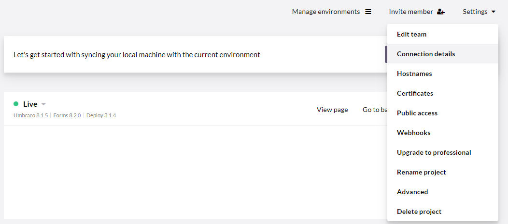
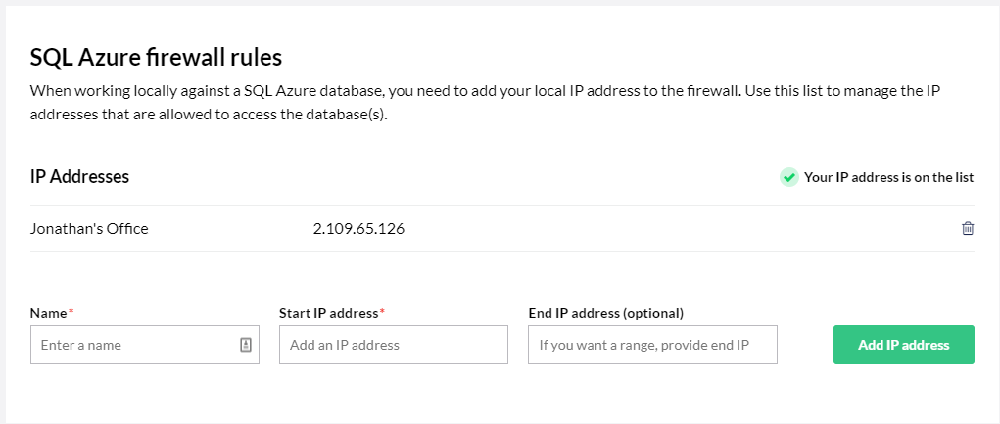

# Database on Umbraco Cloud
In order for you to be able to work with your Cloud database there are a few steps you will need to do before you are able to work with it locally. This article will go through the needed steps. At the end of the article you will be ready to start working with the database.

## Connecting to your Cloud database locally
First, Umbraco Cloud automatically overrides whatever is in the 'umbracoDbDsn' connection string in the web.config when the site is running on Cloud. This means that any connection string in there named 'umbracoDbDsn' will only ever be used when you run the site locally (cloned). In rare cases you might need the database timeout increased on Cloud, for that you'll need to reach out to support for assistance.

Second, for security, your database on Umbraco Cloud is running behind a firewall. In order to connect to the database, you'll need to open the firewall for the relevant IPs. This can be a single IP, a list of IPs or even an IP range. It's done from the Connection Details page on your project. Click the "Settings" menu in the upper right corner of your project and select "Connection Details". If you don't see the menu item, it's due to permissions and you'll need to contact the administrator of your project.



### Opening the firewall
The easiest way to open the firewall for your IP address is to click the "Add Now" link. It'll automatically add your current IP address and save the settings. It might take up to five minutes for the firewall to be open for your IP.

If you need to open for specific IP addresses, click the "Add New IP Address" button.

When adding a new IP, it is required to give it a name. This gives an overview of who the different IPs that have been added belong to.



### Setting up SQL Management Studio
Once the firewall is open, it's time to fire up SQL Management Studio and connect to the database. Be aware that a database exists for each environment you have on Umbraco Cloud and any changes you make to custom tables needs to be done for each of them.

To connect, choose "Connect Database Engine" and copy the values from the Connection Details page on Umbraco Cloud where you'll find handy "copy" shortcut buttons to the right of each value. In the "Connect to Server" dialog in SQL Management Studio, choose "SQL Server Authentication" as the authentication type. Remember to click the "Options" button *before you connect* and paste the name of your database in the "Database" input field (otherwise, security settings on Umbraco Cloud will prevent you from connecting). You can see it all in this short video:

<iframe width="800" height="450" src="https://www.youtube.com/embed/f3YIEHGHZB4?rel=0" frameborder="0" allow="autoplay; encrypted-media" allowfullscreen></iframe>

### Moving on
Now that you've connected you can work with the databases on Umbraco Cloud, like you could on any other host. Remember to let Umbraco Cloud do the work when it comes to the Umbraco-related tables (`Umbraco*` and `CMS*` tables).

## LocalDB
When you clone a site locally, Umbraco Cloud automatically creates a local database and populates it with data from your website running on the Cloud. If you don't specify anything before starting up your site locally, it'll be a SQL CE database that lives in the `/App_Data` folder. If you wish to use a local SQL Server instead, you can update the connection string in the web.config, but it's important that you do so before your site starts up the first time.

By default when Umbraco Cloud restores a local database it will be an Umbraco.sdf file in `/App_Data` folder. However if LocalDB is installed and configured, the restore will create an Umbraco.mdf file. To use LocalDB ensure `applicationHost.config` is configured with `loadUserProfile="true"` and `setProfileEnvironment="true"`: https://blogs.msdn.microsoft.com/sqlexpress/2011/12/08/using-localdb-with-full-iis-part-1-user-profile/

```xml
<add name="ASP.NET v4.0" autoStart="true" managedRuntimeVersion="v4.0" managedPipelineMode="Integrated">
   <processModel identityType="ApplicationPoolIdentity" loadUserProfile="true" setProfileEnvironment="true" />
</add>
```

:::note
If you don´t see the lines in the `applicationHost.config`, you can add them manually to the `<applicationPools>` section.
:::

Usually `applicationHost.config` is located in this folder for IIS:
`C:\Windows\System32\inetsrv\config`

and in one of these folders for IIS Express:

`C:\Users\<user>\Documents\IISExpress\config\`

If you're using Visual Studio 2015+ check this path:
`$(solutionDir)\.vs\config\applicationhost.config`

In Visual Studio 2015+ you can also configure which `applicationhost.config` file is used by altering the `<UseGlobalApplicationHostFile>true|false</UseGlobalApplicationHostFile>` setting in the project file (eg: MyProject.csproj). (source: MSDN forum)

Now that you are all set and ready you can continue to work with your [database locally](../Local-Database).
