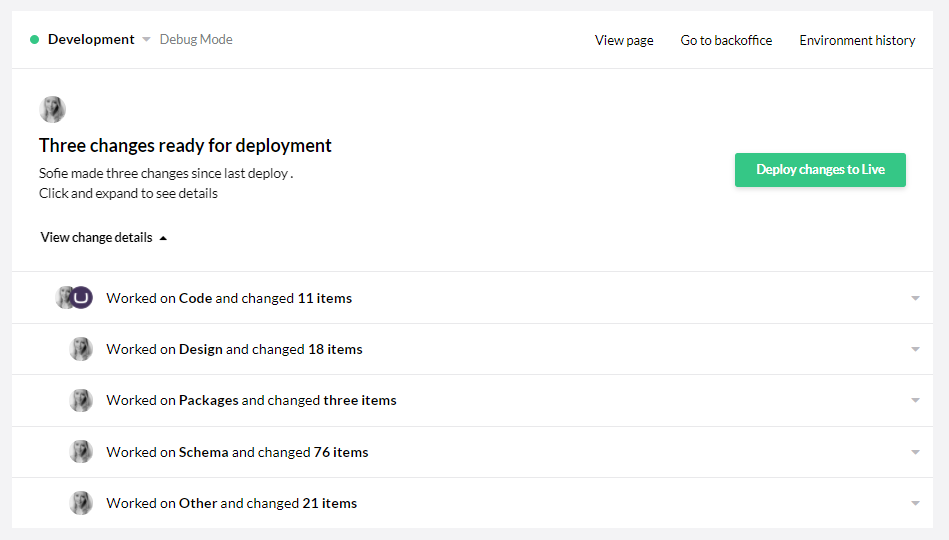
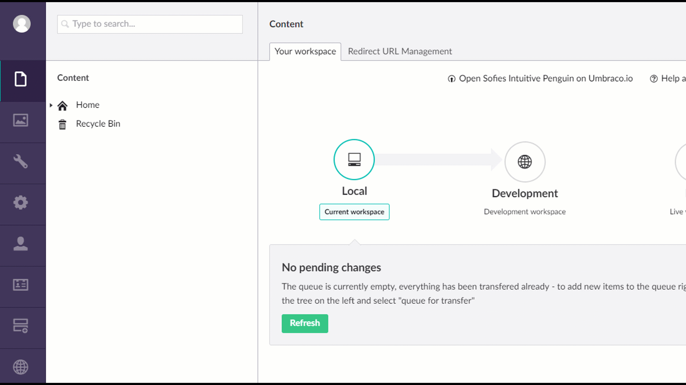

# Deploy to the Cloud

You are almost there! Just a few more steps, and you will be able to see how your migrated project looks on Umbraco Cloud. All project files have been merged and you've generated UDA files for all your metadata. In this chapter, you are going to deploy your entire project to your Umbraco Cloud Development environment.

## Deploying the metadata
1. In your Git client you should see a lot of changes ready to be committed
2. Stage and commit the changes
3. Do a *pull* just to be sure everything is in sync
4. Push your migrated project to the Umbraco Cloud environment - check that the *'Deploy Complete'* message is displayed
    * If you have a very large commit to push, you may need to configure your Git client for this
    * Use: git config http.postBuffer 524288000

When the push is complete go check out the Umbraco Cloud Portal to verify the indicator on the Development environment is still *green*. Go to the backoffice of your Development environment and make sure all your metadata is there. You won't see any content or media on the environment yet - this you will move in the next few steps.

## Transfer your content and media
1. With all your metadata in place, it's time to transfer your content and media as well
2. Go to the backoffice of your local clone of the Umbraco Cloud project
3. Right-click the top of the Content tree and choose *'Queue for transfer'*
    * **NOTE**: If you have a large amount of content and media you may have the best result in deploying content and media independently
    * **Media**: If you have more than "a few" media items see our recommendations for working with [media in Umbraco Cloud](../../Set-up/Media/)

**Voila!** You've now migrated your project to Umbraco Cloud. If your Umbraco Cloud project has two or more environments, it's now time to deploy your changes to the next environment - Staging or Live. You do this from the Umbraco Cloud Portal, using the green button on your Development environment *'Deploy changes to Staging/Live'*. Transfer content and media from the backoffice like before.

[Previous chapter: Generating metadata](part-3.md)
