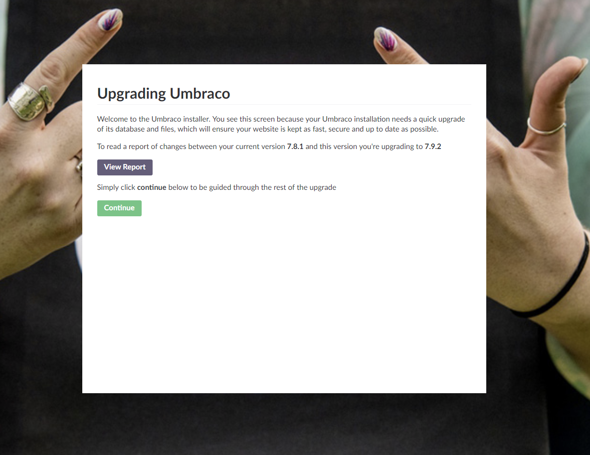

# Manual upgrade of Umbraco CMS on Cloud

This article will give you a step-by-step on how to manually upgrade your Umbraco Cloud project to run the latest version of Umbraco CMS.

## Prepare for the upgrade

When upgrading an Umbraco Cloud project manually, the very first step is to [clone down your Cloud Development environment to your local machine](../../Set-Up/Working-Locally/).

Make sure you can run your Cloud project locally and restore content and media. It's important that you check that everything works once the upgrade has been applied and for this, you need to have a clone locally that resembles the Cloud environment as much as possible.

## Get the latest version of Umbraco

* [Download the latest version Umbraco CMS from Our](https://our.umbraco.com/download/)
* Unzip the folder to your computer
* Copy the following folders from the unzipped folder to your Cloud project folder:
    * `/bin`
    * `/Umbraco`
    * `/Umbraco_Client`

## Merge configuration files

In this step, you need to merge the configuration files containing changes. For this, we recommend using a tool like [WinMerge](http://winmerge.org/) or [DiffMerge](https://sourcegear.com/diffmerge/).

The reason you shouldn't just overwrite these files is that this will also overwrite any **custom configuration** you might have as well as **Umbraco Cloud specific settings**. Read more about which Cloud specific details you should watch out for in the following sections.

### Web.config

When merging the `web.config` file make sure that you **do not overwrite/remove** the following settings:

**< configSettings >**

    <sectionGroup name="umbraco.deploy">
      <section name="environments" type="Umbraco.Deploy.Configuration.DeployEnvironmentsSection, Umbraco.Deploy" requirePermission="false" />
      <section name="settings" type="Umbraco.Deploy.Configuration.DeploySettingsSection, Umbraco.Deploy" requirePermission="false" />
    </sectionGroup>

**< appSettings >**

    <add key="umbracoConfigurationStatus" value="7.8.1" />
    ---
    <add key="UmbracoLicensesDirectory" value="~/App_Plugins/UmbracoLicenses/" />
    <add key="umbracoVersionCheckPeriod" value="0" />
    <add key="umbracoDisableElectionForSingleServer" value="true" />
    <add key="Umbraco.Deploy.ApiKey" value="9BEA9EAA7333131EB93B6DB7EF5D79709985F3FB" />

**< connectionString >**

    <connectionStrings>
        <remove name="umbracoDbDSN" />
        <add name="umbracoDbDSN" connectionString="Data Source=|DataDirectory|\Umbraco.sdf;Flush Interval=1;" providerName="System.Data.SqlServerCe.4.0" />
        <!-- Important: If you're upgrading Umbraco, do not clear the connection string / provider name during your web.config merge. -->
    </connectionStrings>

**< umbraco.deploy >**

    <umbraco.deploy>
        <environments configSource="config\UmbracoDeploy.config" />
        <settings configSource="config\UmbracoDeploy.Settings.config" />
    </umbraco.deploy>

### Dashboard.config

When merging the `Dashboard.config` file make sure that you **do not overwrite / remove** the following settings:

**Deploy**

    <section alias="Deploy">
        <areas>
        <area>content</area>
        </areas>
        <tab caption="Your workspace">
        <control>/App_Plugins/Deploy/views/dashboards/dashboard.html</control>
        </tab>
    </section>

**StartupFormsDashboardSection**

    <section alias="StartupFormsDashboardSection">
        <areas>
        <area>forms</area>
        </areas>
        <tab caption="Dashboard">
        <control>/app_plugins/umbracoforms/backoffice/dashboards/licensing.html</control>
        <control>/app_plugins/umbracoforms/backoffice/dashboards/yourforms.html</control>
        <control>/app_plugins/umbracoforms/backoffice/dashboards/activity.html</control>
        </tab>
    </section>

Note that you **should not merge in** the following section from the new version of Umbraco:

    <section alias="StartupDashboardSection">
        <access>
        <deny>translator</deny>
        </access>
        <areas>
        <area>content</area>
        </areas>
        <tab caption="Get Started">
        <access>
            <grant>admin</grant>
        </access>

        <control showOnce="true" addPanel="true" panelCaption="">
            views/dashboard/default/startupdashboardintro.html
        </control>

        </tab>
    </section>

### Other config files

The following config files contain differences, and in most cases, you need to keep the ones from your Cloud project:

* `/Splashes/noNodes.aspx`
* `trees.config`
* `umbracoSettings.config`

## Run the upgrade locally

When you are done merging the new version of Umbraco with your clone of the Umbraco Cloud project, follow these steps to complete the upgrade:

* Run the project locally
* When the project spins up, you'll be prompted to log in to verify the upgrade
* On the installation screen you need to verify the upgrade:
    
* Hit **Continue** - this will complete upgrading the database
* The upgrade will finish up
* When it's complete you will be sent to the Umbraco backoffice

Make sure that everything works on the local clone and that you can **run the project without any errors**.

## Push upgrade to Cloud

Before you deploy the upgraded project to the Cloud, it's important that you check if there are any [**dependencies**](../Product-Dependencies) on the new Umbraco version.

Are there dependencies for Umbraco Forms or Umbraco Courier / Deploy you need to upgrade these locally, before moving on. 

When you've upgraded everything locally, and made sure that everything runs without any errors, you are ready to deploy the upgrade to Umbraco Cloud.

* Stage and commit all changes in Git
* Push the changes to the Cloud environment
* When everything is pushed, head on over to the Umbraco Cloud Portal
* Access the backoffice of the Cloud environment you pushed the upgrade to - Development or Live
* You will again be prompted to log in to complete the database upgrade
* You will be sent to the backoffice once the upgrade is complete

Again it's **important** that you make sure everything runs without any errors before moving on to the next Cloud environment.
