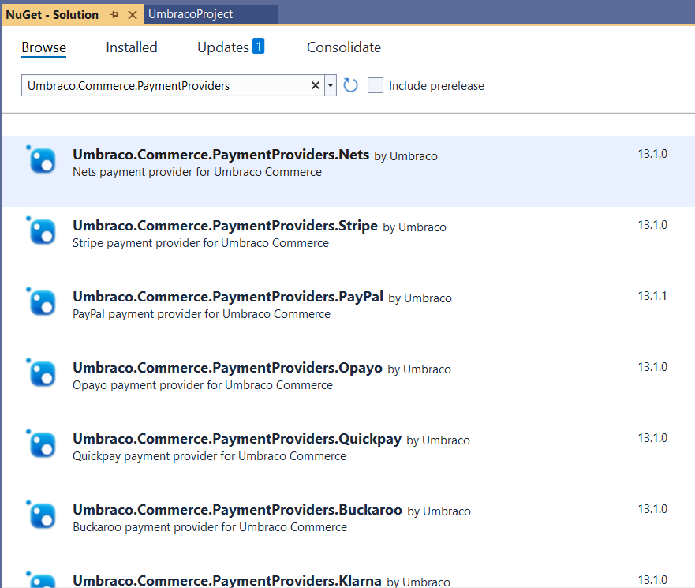

# Install payment providers

When you need to install a payment provider into your Umbraco Commerce implementation it is done via NuGet.

The installation can be handled in one of two ways as explained below.

## Install via the NuGet Manager Console

1. Open the NuGet Manage Console.
2. Type in the following command:

```bash
PM> Install-Package Umbraco.Commerce.PaymentProviders.PROVIDER
```

Use the table of available[Payment Providers](install-payment-providers.md#available-payment-providers) to ensure you get the correct package name for the provider you want to install.

## Install via the NuGet Package Manager

1. Open the NuGet Package Manager.
2. Search for the Payment Provider you want to install.
3. Ensure the "Browse" tab is selected.
4. Install the package into your solution.

Alternatively, you can also find and install the NuGet package via the NuGet Package Manager.



## Available Payment Providers

<table><thead><tr><th width="181">Payment Provider</th><th>NuGet Package name</th></tr></thead><tbody>

<tr><td>Buckaroo</td><td><code>Umbraco.Commerce.PaymentProviders.Buckaroo</code></td></tr>

<tr><tr><td>Klarna</td><td><code>Umbraco.Commerce.PaymentProviders.Klarna</code></td></tr><tr><td>Mollie</td><td><code>Umbraco.Commerce.PaymentProviders.Mollie</code></td></tr><tr><td>Nets</td><td><code>Umbraco.Commerce.PaymentProviders.Nets</code></td></tr><tr><td>Paypal</td><td><code>Umbraco.Commerce.PaymentProviders.PayPal</code></td></tr><tr><td>QuickPay</td><td><code>Umbraco.Commerce.PaymentProviders.QuickPay</code></td></tr><tr><td>Stripe</td><td><code>Umbraco.Commerce.PaymentProviders.Stripe</code></td></tr><tr><td>Opayo</td><td><code>Umbraco.Commerce.PaymentProviders.Opayo</code></td></tr><tr><td>Worldpay</td><td><code>Umbraco.Commerce.PaymentProviders.Worldpay</code></td></tr></tbody></table>

## Default Payment Providers

The following payment providers comes with Umbraco Commerce out of the box.

- Invoicing
- Zero

## Upgrading


Before upgrading, it is always advisable to take a complete backup of your site and database.


Umbraco Commerce uses Umbraco Migrations to install all of its features. Upgrades follow the same process as the installation processes detailed above, by installing the latest version over the top of the existing package installation. By using this process the installation will only install new features and features that are missing.
