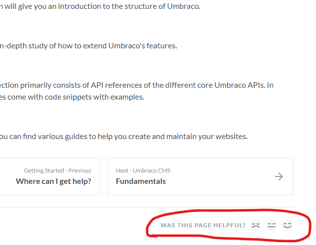

# Submit feedback

There are a couple of different ways to submit feedback on the documentation, be it the entire platform or a single article. This article will give you the overview of the different feedback channels and how to use them.

## Rate an article

At the bottom of each article in our documentation you have an option to rate the content.

<!-- vale off -->
You can rate the content from poor, OK to excellent.
<!-- vale on -->


Page-rating is used when determining which articles needs to be reviewed by the documentation team at Umbraco HQ.

We highly recommend that you rate the articles you come across, as this will help us provide better material across the line.


## Submit a GitHub Issue

The [Issue Tracker](https://github.com/umbraco/UmbracoDocs/issues) is a way to keep track of ideas, issues with wrong or outdated documentation, and discussions with other contributors.

Here are a few examples of what the Issue Tracker can be used for:

- You were looking for a specific piece of information, but couldn't find it.
- You found a broken link on one of the articles.
- You found an article with wrong or outdated information and you do not have the time or knowledge to rewrite it.
- You want to discuss possible improvements or ways to deal with a specific thing in the documentation.

### Creating an Issue

You can add issues directly from the [Issue Tracker on GitHub](https://github.com/umbraco/UmbracoDocs/issues).

We have setup a template that we recommend using when creating an Issue on the tracker. The template gives you a few questions to answer, to help you give the best explanation of what you are reporting or want to discuss.
