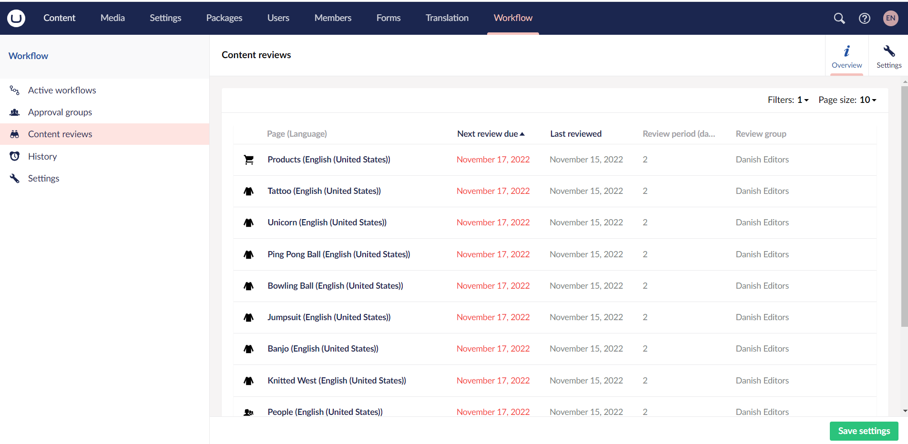
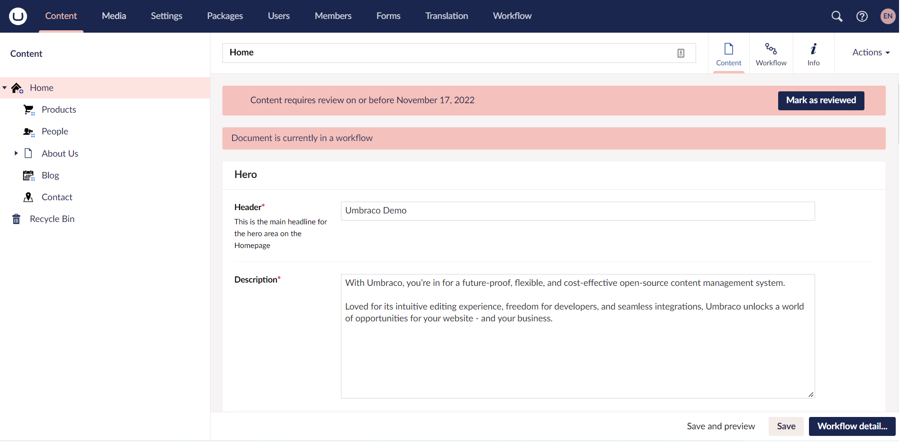
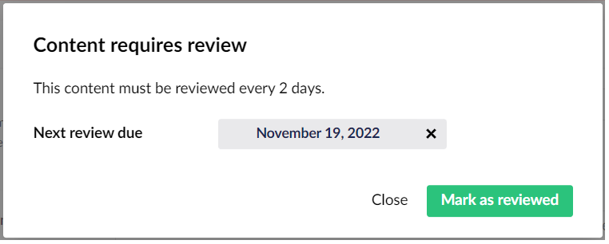
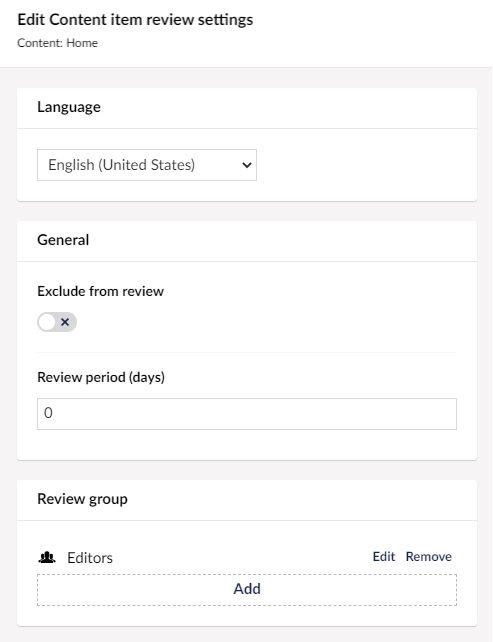

# Content Reviews

Content reviews is a tool that allows content editors to keep their content up-to-date. **Content reviews** adds a new dashboard to the **Workflow** section. By default, Content reviews are disabled and can be enabled from **Content reviews Settings** in the **Workflow** section.

## Content Reviews Dashboard

The Content reviews Dashboard provides an overview of the expired content. The dashboard displays a table containing the following details:

* Page name/Node with the Language variant
* Next review due date
* Last reviewed date
* Review period in days
* Review group

Selecting a content node takes you to the content node in the **Content** section where you can see the Content review banner. The Content review banner is displayed only when the node has passed its review date. Also, the review banner is displayed only to users assigned as reviewers for the node. For more information, see the [Content Reviews Permissions](content-reviews.md#content-review-permissions) section

Clicking on **Mark as reviewed** allows the review group member to mark the content as reviewed. Optionally, the review group member can also set the next review date on the content node. The next review date must fall inside the review period set in the **Content Reviews Settings**.

You can also **Filter** the Dashboard records based on the Node, Group Email, Next review due date, Last reviewed date, and Expired review Status.

Additionally, you can adjust the total number of records displayed on a page.

## Content Reviews Settings

The Content reviews Settings tab provides a range of settings for configuring email notifications, review period days, reminder days, and so on. Using Content reviews, all content has a default review period.

### General Settings

You can configure the **General** Settings from the **Workflow** section in the **Content reviews** menu. The following settings are available:

* **Enable content reviews** - Enable this setting if you wish to remind users to review their content. By default, this option is disabled.
* **Send notifications** - Enable this setting to send email notification to approval groups when content requires review.
* **Treat saving as a review?** - Enable this setting to reset the review date when content is saved. Saving a content node recalculates the review date, using the review period assigned to the content node, its Document Type, or the default Review period value. If disabled, content must be explicitly reviewed via the review banner displayed on the content item.
* **Review period (days)** - The default number of days between content reviews.
* **Reminder threshold (days)** - Determines how many days prior to the review date the Workflow should notify editors of required reviews. By default, the number of days is set to 1.

### Content Review Permissions

You can configure which review group reviews which content nodes or Document Types. The group responsible for reviewing content is derived from the workflow configuration. This means a site with workflow already configured can leverage that permissions model for assigning content review responsibilities. By default, content reviews are assigned to the approval group in the first workflow approval stage.

Content review permissions can be set at the node or Document Type level, both of which take precedence over any existing Workflow permissions.

The current permissions for a content node are displayed in the **Workflow** content app on the **Configuration** tab.

### Content Item and Document Type Reviews

You can configure content reviews for individual content nodes or for all nodes of a given Document Type. For both Content Item and Document Type Reviews, the following Settings are available:

* **Exclude from review** - Enable this setting to ignore the specific content node (or all content nodes of this Document Type) when determining nodes to review.
* **Review period (days)** - The review period in days between required reviews.
* **Review group** - The group responsible for reviewing the content node. Can contain more than one group.


When reviews are enabled or any changes to content review settings are saved, Workflow determines the review status of all the content needing review. It provides this data in the Content reviews Dashboard. For large sites, or on the first run, this may take a few seconds to complete.


#### Content Item Reviews

To add a content item review, follow these steps:

1. Go to the **Workflow** section.
2. Go to the **Settings** tab in the **Content reviews** menu.
3.  Click **Add** in the **Content item reviews** section.\

    <figure><figcaption>
Content Item Reviews
</figcaption></figure>
4.  Select **Content node** to add to the Content item reviews section. \\

    <figure><figcaption>
Select Content Node
</figcaption></figure>
5. Select the **Language** from the drop-down in the **Add Content item review settings** pane.
6. \[Optional] Enable **Exclude from Review** if you wish to exclude this content node from content review. If you enable this setting, skip to step 11.
7. Enter the **Review period** in days.
8. Click **Add** to add the **Review Group**.
9. Select an **approval group**.
10. Click Submit.\

    <figure><figcaption>
Edit Content Item Review Settings
</figcaption></figure>
11. Click Submit.
12. Click **Save Settings**.

To Edit a content item review, click **Edit** and update the settings as per your requirement.

To remove a content item review, click **Remove**.

#### Document Type Reviews

To add a Document Type review, follow these steps:

1. Go to the **Workflow** section.
2. Go to the **Settings** tab in the **Content reviews** menu.
3.  Click **Add** in the **Document-type reviews** section.\

    <figure><figcaption>
Document Type reviews
</figcaption></figure>
4.  Select **Content type** to add to the Document-type reviews section.

    <figure><figcaption>
Select Content Type
</figcaption></figure>
5. Select the **Language** from the drop-down in the **Add Document-type review settings** pane.
6. \[Optional] Enable **Exclude from Review** if you wish to exclude this Document-type from content review. If you enable this setting, skip to step 11.
7. Enter the **Review period** in days.
8. Click **Add** to add the **Review Group**.
9. Select an **approval group**.
10. Click Submit.\

    <figure><figcaption>
Add Document Type Review Settings
</figcaption></figure>
11. Click Submit.
12. Click **Save Settings**.

To Edit a Document-type review, click **Edit** and update the settings as per your requirement.

To remove a Document-type review, click **Remove**.

## Content Review Notifications

Content review notifications use the email template available at `~/Views/Partials/WorkflowEmails/ContentReviews.cshtml`, which can be customized as required. For example to add a corporate branding or send customized messages.

To add templates for other languages:

1. Go to the `~/Views/Partials/WorkflowEmails/` folder.
2. Copy the required template and paste it into the same folder.
3. Append the culture code to the file name prefixed with an underscore.

For example:

* **Default approval request template:**\
  `~/Views/Partials/WorkflowEmails/ContentReviews.cshtml`
* **Danish approval request template:** `~/Views/Partials/WorkflowEmails/ContentReviews_da-DK.cshtml`
